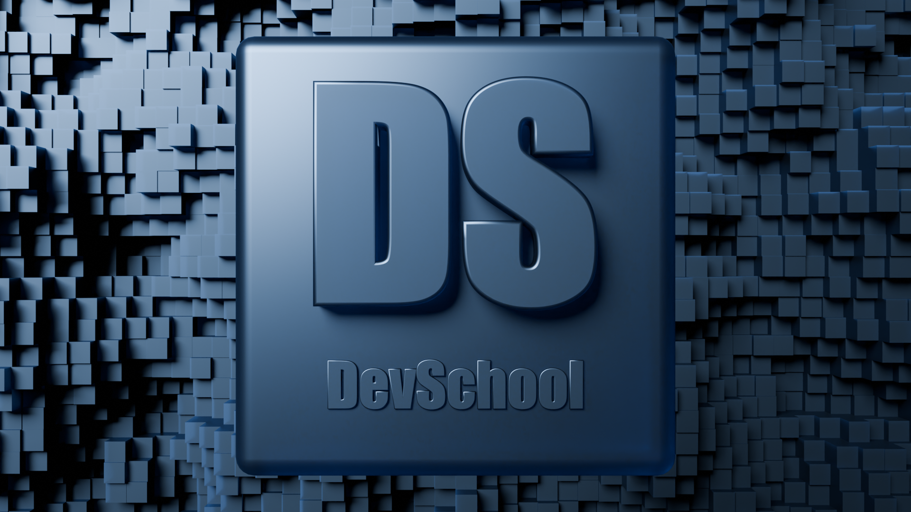

# Добро пожаловать!

Вы находитесь в репозитории, где собрана база знаний по некоторым областям IT. Данная база не претендует на полноту, скорее это коллекция заметок для того, чтобы нам, создателям этой базы, было проще освежить в памяти некоторые моменты, которые связаны с разработкой.

### Содержание  

#### Программы 
- [VS Code](articles/software/vscode.md)
- [Видеозапись](articles/software/videorecording.md) - здесь собрана информация о программах, преимущественно OBS и Avidemux, которые предназначены для записи и обработки видео.
- [Улучшение звука из микрофона в OBS](articles/software/obsCleanVoice.md)
- [Символьные ссылки в Windows](articles/software/simbLinkWin.md)

#### Игры
- [**Minecraft**. Mekanism](articles/games/minecraftMekanism.md)

#### Программирование
- **Frontend**
  - [:e-mail: HTML и CSS](articles/coding/frontend/html_css.md)
  - [:e-mail: Emmet](articles/coding/frontend/emmet.md)
- **Python**
  - [Парсинг в requests и bs4](articles/coding/python/requests_and_bs4.md)
  - [Парсинг в Selenium](articles/coding/python/selenium.md)
  - [Регулярные выражения](articles/coding/python/regex.md)
  - [ООП](articles/coding/python/oop.md)
  - [Pandas](articles/coding/python/pandas.md)
  - [PyAutoGUI](articles/coding/python/pyautogui.md)
  - [JSON](articles/coding/python/json.md)
  - [Pillow](articles/coding/python/pillow.md)
  - [Виртуальное окружение](articles/coding/python/virtualenv.md)
- **C# Unity**
  - [:video_game: Базовый C#](articles/coding/csharp_unity/csharp_base.md)
  - [:video_game: Базовый скриптинг](articles/coding/csharp_unity/base_scripting.md)
  - [:video_game: Физика](articles/coding/csharp_unity/physics.md)
  - [:video_game: Звуки](articles/coding/csharp_unity/sounds.md)
  - [:video_game: Система частиц](articles/coding/csharp_unity/particle.md)
- **Godot**
  - [:video_game: Основы](articles/coding/godot/osnovy.md)
  - [:video_game: Скриптинг](articles/coding/godot/scripting.md)
- [**Git**](articles/coding/git.md)
- [**Docker**](articles/coding/docker.md)

#### Blender
- **Моделирование**
  - [:doughnut: Режим редактирования](articles/blender/modelling/editmode.md)
  - [:doughnut: Скульптинг](articles/blender/modelling/sculptmode.md)
  - [:doughnut: Материалы и UV развертка](articles/blender/modelling/materials.md)
  - [:doughnut: Работа с кривыми](articles/blender/modelling/curve_vorking.md)
  - [:doughnut: Анимация](articles/blender/modelling/animation.md)
    - [Ограничители](articles/blender/modelling/constraints.md)
    - [Экшены](articles/blender/modelling/actions.md)
  - [:doughnut: Compositing](articles/blender/modelling/compositing.md)
  - [:doughnut: Аддоны](articles/blender/modelling/addons.md)
  - [:doughnut: Приемы работы](articles/blender/modelling/make_examples.md)
  - [:doughnut: Рендеринг](articles/blender/modelling/rendering.md)
  - [:doughnut: Физика](articles/blender/modelling/physics.md)
  - [:doughnut: Ассеты](articles/blender/modelling/assets.md)
  - [:doughnut: Видеомонтаж](articles/blender/modelling/video_editing.md)
  - [:doughnut: Новая система волос](articles/blender/modelling/new_hair_system.md)
  - [:doughnut: Рендеринг в Google Collab](articles/blender/modelling/rendering-in-google-collab.md)
  - [:doughnut: **Нейросети**](articles/blender/modelling/neural_networks.md)
- **Geonetry Nodes**
  - [:earth_asia: Введение](articles/blender/geometry_nodes/introduction.md)
  - [:earth_asia: Работа с кривыми](articles/blender/geometry_nodes/curves.md)
  - [:earth_asia: Рандомное распределение примитивов](articles/blender/geometry_nodes/random_distribute_primitives.md)
- **Подготовка модели к игре**
  - [Запекание](articles/blender/modelling/baking.md)
  - [Экспорт и перенос в Unity](articles/blender/modelling/export_models_in_unity.md)
  - [Создание HDRI](articles/blender/modelling/hdri_making.md)
  - [Текстурирование в Substance Painter](articles/blender/texturing/substance_painter_beginning.md)

#### Нейросети

- [Stable Diffusion в Google Collab](articles/neuronetworks/stable-diffusion-in-google-collab.md)
- [Stable Diffusion](articles/neuronetworks/stable-diffusion.md)
- [Ollama](articles/neuronetworks/ollama.md)

<!-- #### Фильмы  
- Такси  
[Актёры из фильма](articles/movies/taxi_1-2-3/actors.md)  
[Автомобиль из фильма](articles/movies/taxi_1-2-3/car.md) -->