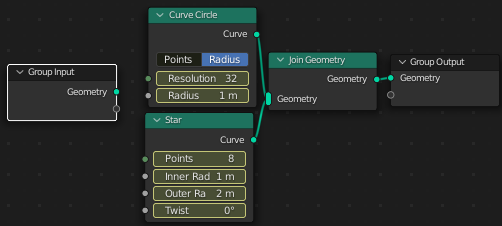

# Geometry Nodes -  Работа с кривыми

Разберем некоторые аспекты работы с кривыми вместе с геонодами.

## Базовые примитивы

Для кривых, как и для мешей, есть свои базовые примитивы, например кривая Безье или звезда. При добавлении примитива к ноде Group Input примитив не подключается, так как в этом случае входом служит примитив, а не объект, на который наложен модификатор Geometry Nodes.

Кривые можно смешивать, используя ноду Join Geometry, как и обычно. Вот так будет выглядеть смешивание крифой круга и звезды.

Здесь можно поиграться с параметрами, например, установить радиус.

Подключим Fill Curve между Group Output и Join Geometry, и мы увидим, что происходит заливка участков между кривыми. А подключив ноду Fillet Curve между Join Geometry и Fill Curve и регулируя его параметр, можно получить абстракцию... на самом деле происходит в некотором роде сглаживание, если число не очень большое.

Удалим Fill Curve и Fillet Curve. А теперь добавим толщину кривой. Подключаем Curve to Mesh между Join Geometry и Group Output. В Curve to Mesh(Profile Curve) включаем Curve Circle и регулируем радиус, тем самым изменяя толщину кривых.

[:rewind:**Вернуться назад**](../../../README.md)