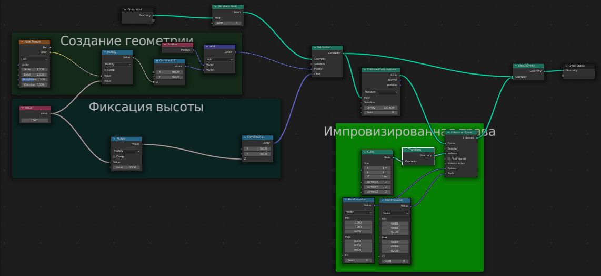
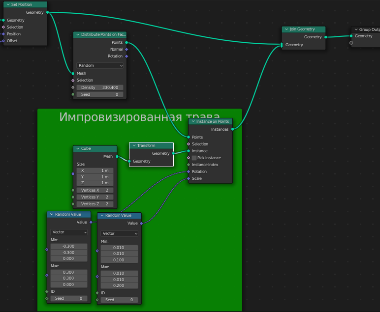

# Geometry Nodes Введение

Геоноды позволяют производить различные манипуляции с геометрией объектов.

Дальше будем разбирать, повторяя плейлист с видеоуроками по этой теме, но пояснения будут на русском.

Создадим геоноду и добавим ноду **Transform**. Это аналог боковой панели, где можно задать положение объекта, вращение и деформацию.

Теперь размножим наши объекты, добавив несколько **Transform** и 1 J**oin Geometry**.

Для добавления **Subdivision Surface**, найдем одноименную ноду и вставим ее между **Group Output** и **Join Geometry**.

Добавим **Convex Hull** между **Subdivision Surface** и **Join Geometry**. Видим, как всю геометрию покрыла другая геометрия.

Попробуем превратить эту сплошную геометрию в каркас. Для этого между **Group Output** и **Subdivision Surface** добавим **Mesh to Curve**, затем, сразу после нее добавляем **Curve to Mesh**. В разъем **Profile Curve Curve to Mesh** добавим один из примитивов кривых - **Curve Circle**. Теперь у каркаса появилась толщина.

Это был один из примеров.

### Пример 2. Создание поляны.

#### Часть 1. Создание ландшафта

1. Создаем плоскость и добавляем к ней геоноду.
2. Между **Group Input** и **Group Output** вставим ноду **Set Position**. Она нужна, чтобы производить различные манипуляции с геометрией.
3. Как и с модификатором Displace, здесь нужно подразделить плоскость. Для этого вставим ноду **Subdivide Mesh** между **Group Input** и **Set Position**.
4. Теперь нужно явно указать на то, что будет производиться трансформация сетки. Для этого в **Set Position(Position)** вставим единственный разъем ноды **Position**.
5. Так получается, что нам нужно поместить в **Set Position(Position)** 2 разъема. Для этого используем ноду **Vector Math** и поставим ее между **Set Position(Position)** и **Position**.
6. В нижний разъем **Vector Math** подключим текстуру **Noise**. Здесь у нас есть 2 проблемы. Во-первых, нужно как-то регулировать интенсивность. Для этого между **Noise** и **Vector Math** ставим **Math** и выбираем в ней Multiply, то есть умножение. Во-вторых, смещение идет по всем осям. Чтобы сделать смещение только по оси Z ставим между **Math** и **Vector Math** **Combine XYZ** и перемещаем провод в координату Z. Теперь смещение идет только по Z.
7. Но при увеличении интенсивности плоскость смещается вверх, а это нам не нужно. Ставим ноду **Value** и соединяем провод с нижним выходом **Math**, которая соединена с **Noise**. Из **Value** протягиваем провод в **Set Position(Offset)**. Между **Value** и **Set Position(Offset)** ставим **Combine XYZ** для разделения на X, Y и Z.

На этом первую часть можно заканчивать. Вот, как будут выглядеть ноды геометрии по итогу...

#### Часть 2. Распределение травы

Распределим на поверхности траву.

1. Перед Froup Output добавим Distribute Points on Faces. Видим, что поверхность превратилась в кучу точек. Поставим Join Geometry между Group Output и Distribute Points on Faces, и соединим Join Geometry и Set Position. Теперь видна и поверхность.
2. Далее нужно добавить объект распределения. Это может быть к примеру трава, делевья или камни. Ставим между Distribute Points on Faces и Join Geometry Instance on Points. 
3. Объект распределения можно создать привычным способом, перетащить его из Outlinerа и подключить вывод Geometry к Instance on Points(Instance). Но попробуем создать для примера куб прямо в геонодах. Для этого из примитивов мешей выберем Cube. Cube(Mesh) соединяем с nstance on Points(Instance). Уменьшаем размер куба и видим, как маленькие кубики распределены по поверхности.
4. Регулировать интенсивность распределения можно в ноде Distribute Points on Faces, в параметре Density.
5. В ноде меша трансформируем меш.
6. Видим, что наша импровизированная трава протыкает поверхность насквозь, давайте ее немного поднимем. Для этого между Cube и Instance on Points вставим Transform. Теперь можно управлять параметрами куба как из боковой панели. Поднимем здесь по Z.
7. Трава не может быть одинакового размера и с одинаковым углом наклона. Поэтому добавим Random Value в Instance on Points(Scale). В Random Value выбираем Vector и ставим min(x=0.01, y=0.01, z=0.1), max(x=0.01, y=0.01, z=0.2). Добавим Random Value в Instance on Points(Rotation). В Random Value выбираем Vector и ставим min(x=-0.3, y=-0.3, z=0), max(x=0.3, y=0.3, z=0). Теперь импровизированная трава выглядит чуть естественнее.

Вот схема в целом, но плохо разобрать.

А вот участок с новыми нодами.

#### Часть 3. Избирательное распределение травы

Сделаем так, чтобы трава росла только на верхних участках поверхности. Для этого в Distribute on Points(Density) Вставим нашу текстуру шума, а между ними поставим Math с параметром Multiply. А между Math и Noise поставим ColoRamp, чтобы регулировать значения.

[:rewind:**Вернуться назад**](../../../README.md)