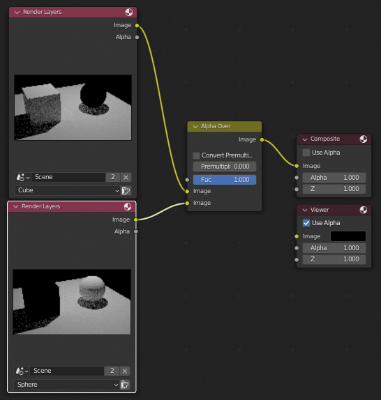

# Постобработка

Здесь будут рассмотрены некоторые приемы постобработки.

## Знакомство с Compositor

Сначала надо отрендерить картинку.

Это и есть окно постобработки. Оно очень похоже на окно Shader Editor. Поставив галочку Use Node, увидим 2 ноды. Render Layers - нода с отрендеренным изображением, а Composite - выходное изображение после постобработки. Добавив ноду Wiewer и соединив ее вход Image с одноименным выходом Render Layers, и нажав кнопку BackDrop, мы увидим отрендеренное изображение как фон редактора нодов.

Для простого примера возьмем ноду Hue Saturation и вставим ее между двумя соединенными нодами и покрутим параметры.

## Слои

Для экономии ресурсов и большей маневренности лучше расбрасывать объекты или группы объектов по слоям. Таким образом можно обрабатывать отдельные части сцены, не затрагивая другие элементы.

Для примера создадим в сцене сферу. Куб уже есть. Теперь создадим плоскость, на которой будут куб и сфера. Теперь раскидаем куб и сферу по одноименным коллекциям коллекциям. Выставим вид из камеры.

> Иерархия проекта
> 
> - Collection
>   - Camera
>   - Light
>   - Plane
> - Cube
>   - Cube
> - Sphere
>   - Sphere

Далее в оутлайнере ищем перевернутый треуголиник со стрелочкой, щелкаем по ней и активируем HoldOut.

Переименовываем слой в Cube. Видим, что напротив коллекций, где значок глаза, но правее, появился кружочек. Щелкнем по нему для коллекции Sphere - теперь сфера стала маской. Далее создаем новый слой Sphere и аналогично добавляем маску для слоя с кубом.

Осталось нажать F12. Отрендерится 2 изображения. 

Теперь переходим в Композитор и делаем как на картинке ниже.

Теперь можно обрабатывать отдельные объекты, подключив ноды обработки между Render Layers и Alpha Over.

[:rewind:**Вернуться назад**](../../../README.md)