# Материалы

Здесь рассмотрим особенности материалов и работы с нодами.

## Система нодов

Разделим окно и откроем Shader Editor.

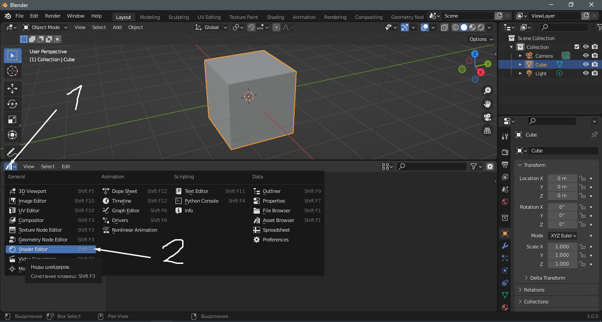

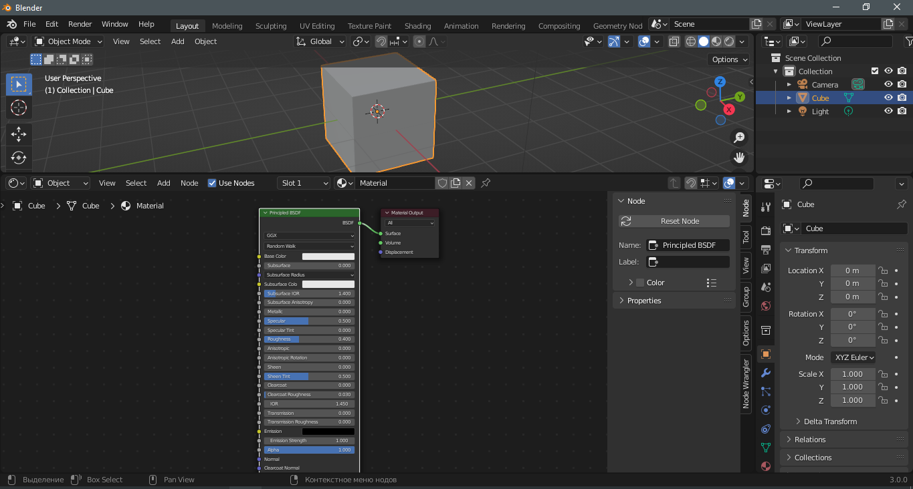

### Горячие клавиши

|Сочетание клавиш|Описание
|----|----
|**Shift A**|Меню выбора нодов
|**H**|Сделать ноду компактной
|**Del, X**|Удалить ноду
|**Ctrl J**|Поместить несколько нодов в фрейм
|**Ctrl G**|Поместить выбранные

### Введение в основы

Все ноды разделены по группам. Есть шейдеры, есть текстуры, ноды обработки цвета и так далее. Дальше разберем некоторые группы подробнее.

**Shader** - здесь собраны все шейдеры. По сути это способ отрисовки всего остального и основа для любого материала.  
**Texture** - группа, где можно выбрать процедурные текстуры или загрузить конкретную картинку, или создать свою.  
**Color** - здесь все, что связано с обработкой и смешиванием цветов.  
**Vector** - различные ноды, которые определяют положение текстур, их отрисовку и так далее.  
**Converter** - ноды преобразования. Преобразуют одни данные в другие.  
**Search** - здесь можно искать ноды.

### Управление Shader Editor

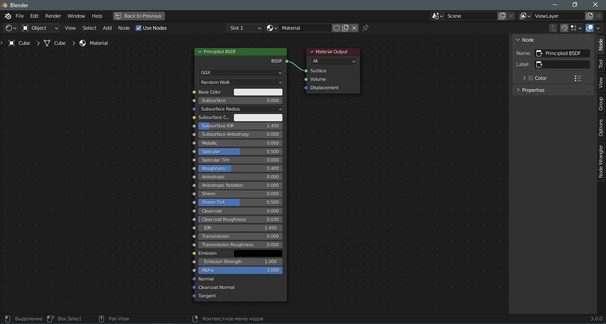

Нажав CtrlSpace можно развернуть окно на весь экран, так же и для того, чтобы перейти обратно. На картинке выше мы видим ноду Output и Principled BSDF. Output - это нода выхода. По сути то, что мы будем видеть в итоге, а нода Principled BSDF - это шейдер, который является основой для любого материала.

Разберем подробнее Output.

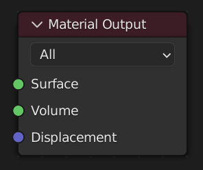

Surface - то, что будет отрисовываться на поверхности меша.  
Volume - то, что будет отрисовываться внутри. Обязателен рендер Cycles.  
Displacement - задает дополнительные изменения геометрии. Обязателен рендер Cycles.

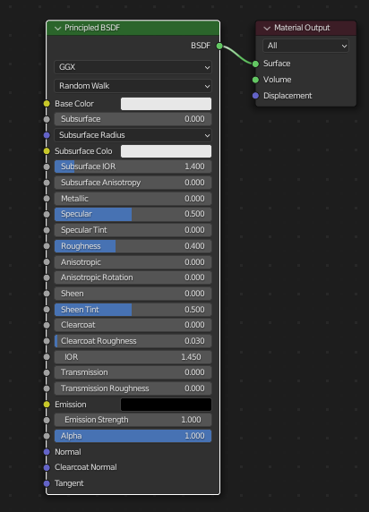

В нашем примере выход шейдера подключен к Output в гнездо Surface. Так мы будем отрисовывать шейдер на поверхности.

Нажав Ctrl и проведя ПКМ по проводу, его можно перерезать. Если зажать Ctrl и зажать ЛКМ по гнезду входа, где есть соединение, можно отключить его от гнезда и переключить в другое. Щелкая по ноде и нажимая M, мы замораживаем ноду, фактически отключая ее. Колесо мыши масштабирует ноды. Ноду можно двигать мышкой или клавишей G и можно задать координату X или Y.

Поля, которые встречаются достаточно часто...

|Поле|Описание
|---|---
|**Color/Base Color**|Базовый цвет
|**Specular**|Влияние окружающей среды - отражения
|**Roughness**|Шероховатость
|**IOR**|Индекс преломления
|**Normal**|Вход для карт нормалей
|**Strength**|Интенсивность

## Создание материалов и способы применения

### 1 способ создания материала

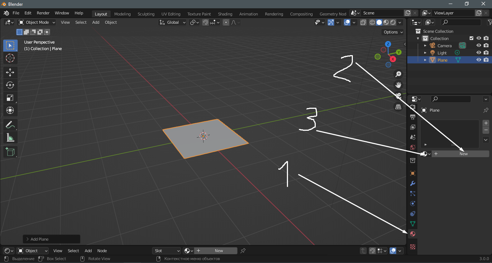

1. Переходим в управление материалами.
2. Нажимаем New.
3. Здесь можно выбрать уже созданные материалы.
4. Можно и нужно переименовать материал и дать ему осмысленное имя.
5. Нажав на +, можно добавить еще один материал.
6. Нажав на значок щита, можно сохранить материал в памяти проекта. Таким образом он останется даже если его нигде не используют, а неиспользуемые материалы удаляются после закрытия программы.

### 2 способ создания материала

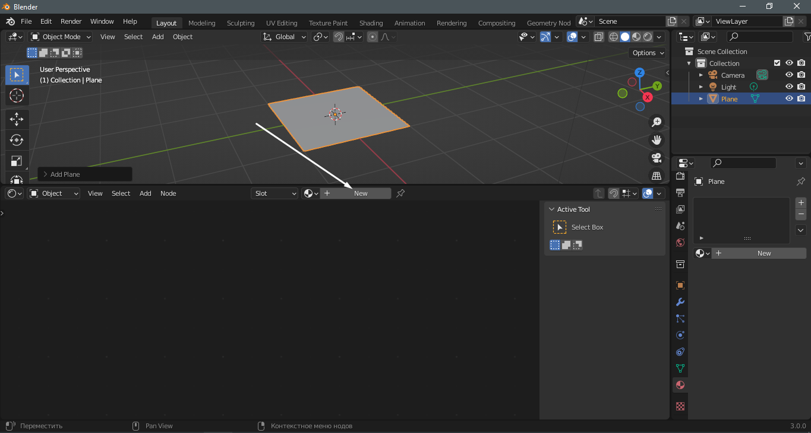

Дальше по сути как и в первом способе.

### Применение материала в режиме редактирования

Создадим uv сферу и добавим ей 2 материала. Первый материал - основной. Второй материал я сделал металлическим и добавил ему блеск, регулируя Roughness.

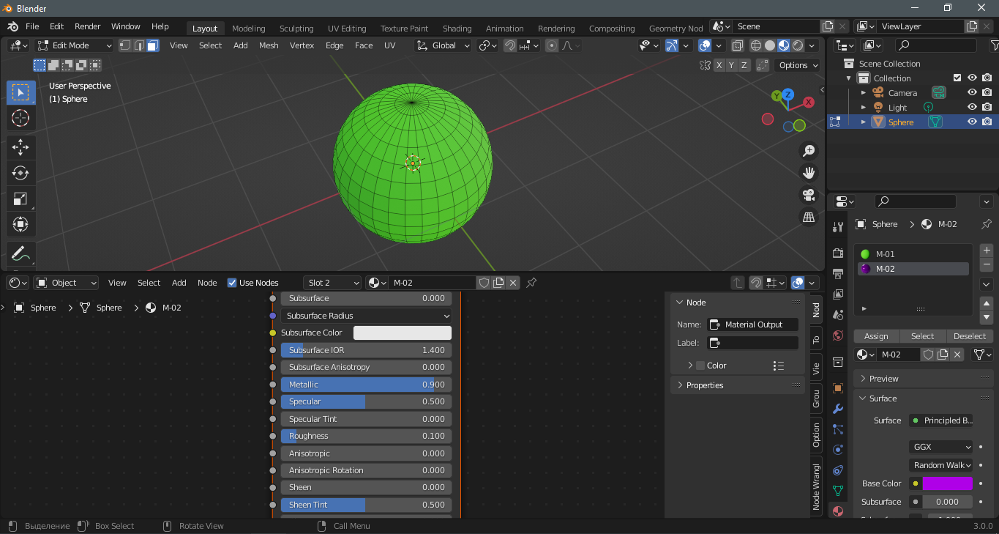

Теперь выделим несколько граней. Перейдем в вкладки с материалами, выберем нужный и нажмем Assign.

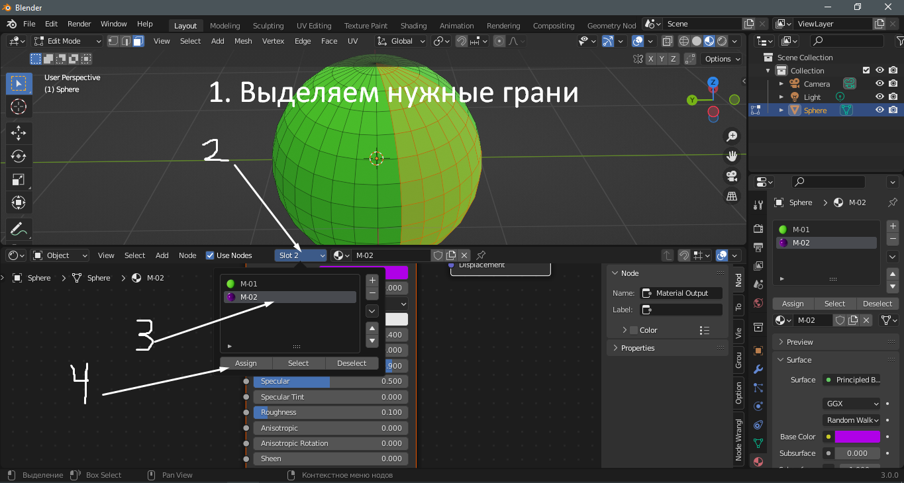

Вот, что у нас получилось. Я добавил Shade Smooth, чтобы сделать сферу гладкой.

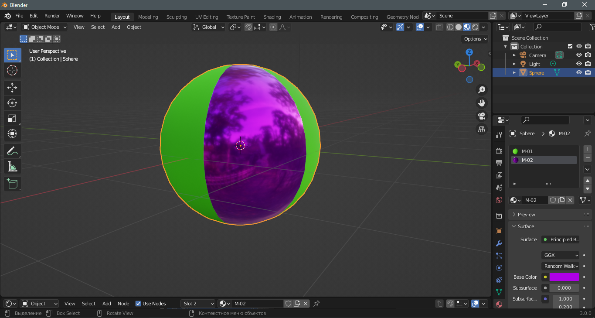

## Шейдеры

Разберем некоторые шейдеры

|Название|Вид|Описание
|---|---|---
|**Principled BSDF**|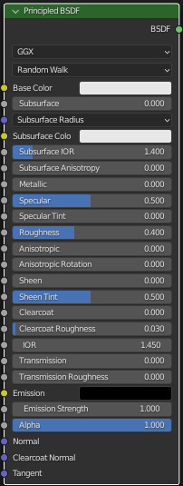|Стандартный шейдер, в котором уже есть по сути все необходимое
|**Emission**|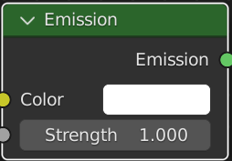|Шейдер свечения
|**Glass BSDF**|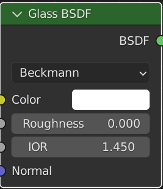|Шейдер стекла
|**Glossy**|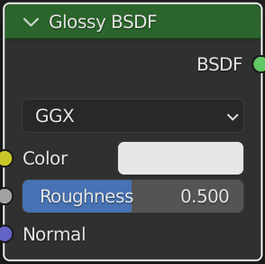|Шейдер глянца
|**Mix Shader**|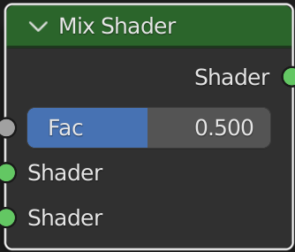|Смешивает 2 шейдера
|**Principled Volume**|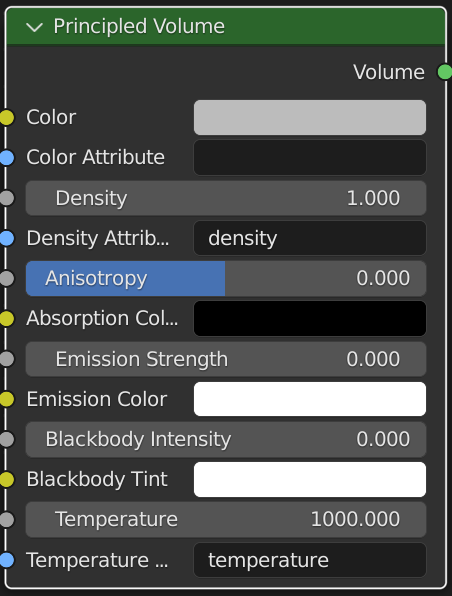|Универсальный шейдер для Volume. Использовать рендер Cycles.
|**Translucent BSDF**|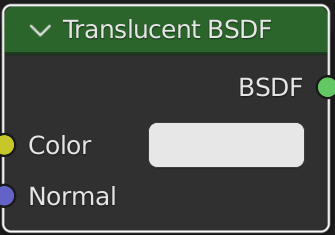|Позволяет сделать просвечиваемые материалы, как у листвы.

## Текстуры

Бывают процедурными и в виде готовых или создаваемых картинок. Ниже рассмотрим разные процедурные текстуры, которые подключим в Base Color.

### Часто встречающиеся поля
|Наименование|Описание
|---|---
|**Scale**|Размер
|**Vector**|Положение текстуры
|**Detail**|Детализация
|**Color**|Цвет
|**Distortion**|Искажение

### Список часто используемых текстур
|Название|Вид|Описание|Socketы
|---|---|---|---
|**Brick**|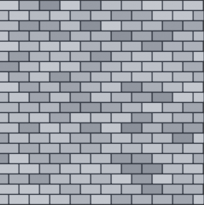|Кирпичная кладка|**Offset** - отступ. **Mortar** - цемент. **Mortar Size** - расстояние между кирпичами. **Mortar Smooth** - сглаживание границ. **Bias** - смешивает цвета. **Brick Width** - ширина кирпичей. **Row Height** - высота кирпичей.
|**Checker**|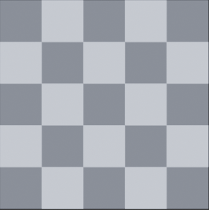|Шахматный вид|---
|**Enviromment**|---|Окружение, например для HDRI текстур|---
|**Gradient**|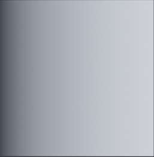|Градиент|---
|**Image**|---|Готовая картинка|---
|**Magic**|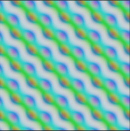|Описание отсутствует|**Depth** - уровень детализации.
|**Musgrave**|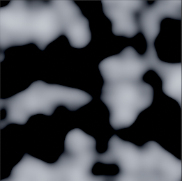|Описание отсутствует|**Dimension** - добавляет зернистость. **Lacunarity** - компанует зернистость ближе к крупным островкам.
|**Noise**|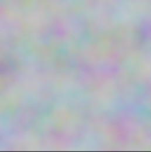|Шум|---
|**Sky**|---|Процедурная текстура неба|**Sun Disc** - включить/выключить отображение Солнца. **Sun Size** - размер Солнца. **Sun Intensit** - интенсивность свечения Солнца. **Sun Elevation** - угол наклона Солнца. **Sun Rotation** - угол вращения Солнца. **Air** - воздух. **Dust** - пыль. **Ozone** - озон.
|**Voronoi**|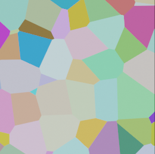|Описание отсутствует|**Randomness** - рандомные углы.
|**Wave**|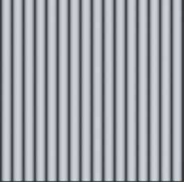|Волна|**Phase Offset** - движение волны

### Положение текстуры и карты нормалей

Помимо добавления шейдеров и текстур, важную роль играет и положение материала на объекте. Для дальнейших действий понадобится аддон Node Wrangler, который поставляется вместе с Blender.

Теперь выделим текстуру и нажмем Ctrl T.

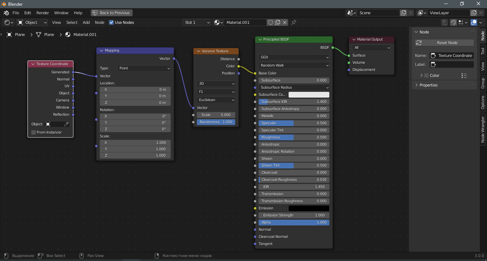

Видим, что появились 2 ноды.

Mapping - способ размещения текстуры.  
Texture Coordinate - способ наложения текстуры.

Здесь можно поменять способ наложения, например, если есть UV развертка.

### Карты нормалей

Для реалистичности нужно, чтобы у материала был рельеф, но создание рельефа вручную требует много полигонов, что влечет за собой проблемы производительности и сложности при экспорте модели и анимации.

Для примера создадим плоскость и добавим на нее Brick Texture, предварительно создав материал.

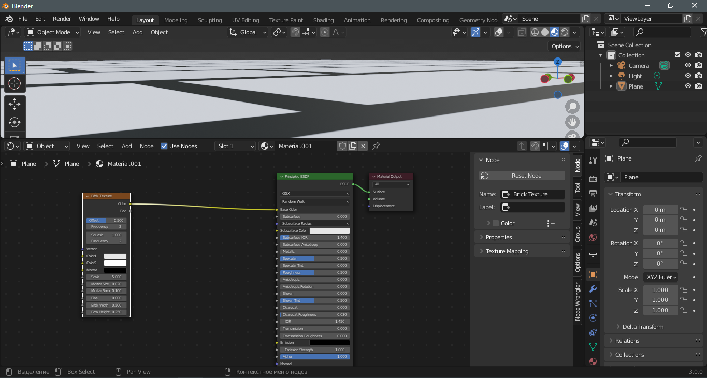

Материал абсолютно гладкий. Теперь добавим еще несколько нодов и посмотрим, что изменится.

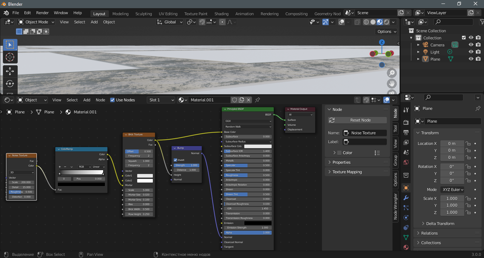

Нода Bump здесь главная, так как она как раз преобразует изображение в карту нормалей. Остальные ноды я добавил для создания рельефа.

ColoRamp - одна из нод для манипуляции с цветом.

## UV развертка

Для наложения текстуры меш нужно развернуть на плоскости. Делается это при помощи создания швов и разворачивании меша.

### Знакомство с UV Editor

Развертка будет отображаться в редакторе в том случае, если в вьюпорте выбран режим редактирования и выделены развернутые части.

В редакторе развертки нажмем на Owerlays. Здесь находятся настройки отображения развертки. Параметр Display Stretch показывает искажения развертки. Синий цвет - искажений нет. Другими словами - это идеальная развертка, но все индивидуально. Так же в Owerlays можно изменить способ отображения ребер.

### Порядок действий для UV развертки

1. В режиме выделения ребер выбираем швы.
2. Жмем **ПКМ** и выбираем **Mark Seam**.
3. Выделяем весь меш и жмем **U - Unwrap**. Все - развертка готова.
4. Выставляем в **Texture Coordinate** наложение **UV**.

[:rewind:**Вернуться назад**](../../../../README.md)