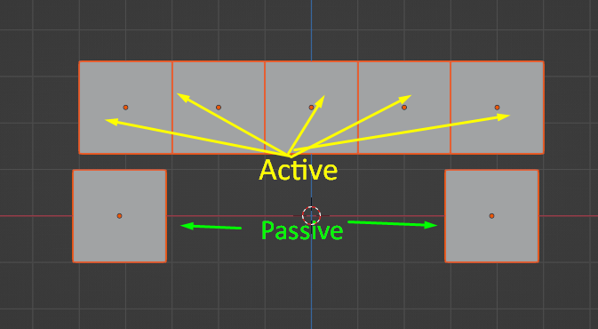
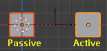
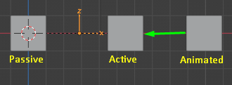
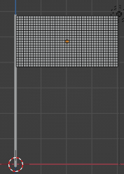
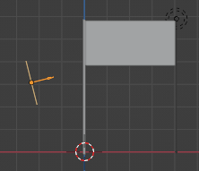
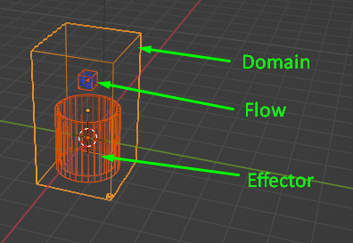

# Физика

В этом разделе рассмотрим физику и симуляции, основанные на ней.

## Содержание

- [Rigid Body](#Rigid_body)
  - [Параметры](#Параметры)
  - [Ограничители](#Ограничители)
- [Cloth](#Cloth)
  - [Подготовка к симуляции](#Подготовка_к_симуляции)
  - [Параметры ткани](#Параметры_ткани)
  - [Практика. Создание флага](#Практика_Создание_флага)
- [Симуляция жидкостей](#Симуляция_жидкостей)
  - [Алгоритм создания жидкостей](#Алгоритм_создания_жидкостей)
  - [Разделы настроек](#Разделы_настроек)

## Rigid_body

**Rigid body** - физика твердых тел. Рассмотрим некоторые физические свойства такие как сила притяжения, трение и так далее.

Рассмотрим простую симуляцию, когда объект падает на поверхность. Для этого сначала создадим поверхность, на которую будет падать объект - пусть будет плоскость, а затем создадим куб, который будет падать. Сразу обращаем внимание на то, что физику можно увидеть проиграв анимацию и, в зависимости от сложности просчетов, система может подтормаживать или реально повиснуть.

Выделим куб и перейдем к настройкам физики, щелкнем по пункту **Rigid Body** и поставим **Type=Active**. То же самое делаем для плоскости, но тут **Type=Passive**. А теперь запустим анимацию, нажав Пробел и увидим, что кубик падает на плоскость. В данном случае куб активен (Active) так как падает на пассивную плоскость (Passive). Если установить плоскости активный тип, то плоскость упадет так же как и куб.

### Параметры

#### Настройки физики

**Settings**  
**Mass** - масса объекта.  
**Dynamic** - переключатель, который включает или отключает падение. Позволяет контролировать ход симуляции, так как можно для него назначить ключи анимации и сделать так, чтобы симуляция запускалась не сразу после старта анимации.  
**Animated** - примерно то же самое, что и предыдущий, но позволяет задавать свою анимацию объекту.  
**Collisions**  
**Shape** - задает форму для рассчета физики. Для большего реализма можно ставить Mesh или Convex, но все зависит от ситуации.  
**Surface Response**  
**Friction** - трение.  
**Bounciness** - отскок. Не путать с упругостью по типу мяча. Отскоки идут между активными объектами.  
**Sensitivity**  
**Collision Margin** - задает отступ коллайдера. Помогает фиксить проникновение активных объектов сквозь пассивные.  
**Dynamics**  
**Damping** - позволяет регулировать скорость падения.  
**Rotation** - позволяет изменять силу вращения.  
**Deactivation** - запускает симуляцию только при взаимодействии с другими активными объектами. Можно использовать при разрушениях - разрушения не будут происходить сразу, а начнутся при взаимодействии с активным телом, которое призвано его разрушить.  

#### Настройки сцены

**RigidBody World**  
**Speed** - скорость симуляции.
**Substeps Per Frame** - количество просчетов физики за 1 кадр.

### Ограничители

**Применение Connect**  
С помощью этого свойства можно связать активные объекты и, регулируя параметры, менять свойства связи, например силу.  
Создадим 2 куба и применим к ним Rigid Body с типом Passive, затем добавим ряд из 5 кубов, добавим им Rigid Body, но с типом Active и разместим как на картинке.

Теперь выделяем активные кубы, жмем Object/Rigid Body/Connect. Видим, что в оутлайнере появились пустышки со своей физикой - это и есть наша связка, которая связывает активные кубы. Если запустить анимацию, увидим, что кубы падают, но они связаны.  
А теперь попробуем отрегулировать эту связь. Выделим пустышки и в последнюю очередь выделим активную пустышку... ну да. Перейдем в физику и установим Type=Point. Активируем чекбокс Breakable и под ним можно регулировать ползунок. Затем жмем ПКМ по чекбоксу и выбираем Copy to Selected. То же самое делаем и с ползунком ниже.  
Теперь объекты будут разрушаться, если импульс превысит определенное значение.

**Еще одно применение Connect с типом Point**  
Мы можем сделать эффект качелей. Создадим 2 куба и назначим для одного Rigid body/Passive, а для второго Rigid Body/Active.

Выделим оба и назначим Connect как в предыдущем примере. Щелкнем по пустышке, зайдем в настройки физики и выставим Type=Point. Теперь запустим анимацию и увидим качание. Чекбокс Disable Collisions отключает столкновения. Для реалистичности лучше его деактивировать.  
Переместив пустышку к центру пассивного куба мы делаем его осью, вокруг которой происходит качание.

**Тип Hinge**  
Это имитация шарнира. Нужно активировать чекбокс Z Angle. При ударе будет вести себя как шарнир. По умолчанию используется ось Z.

**Тип Slider**  
Создает эффект по типу сцепления вагонов. Создадим 3 куба, назначим им физику как и в прошлые разы, но на 3 куб ставим Type=Active и активируем чекбокс Animated. Далее анимируем 3 куб, чтоб он столкнулся сс кубом, на который указывает стрелка на картинке.

В пустышке выставим тип Slider и запустим анимацию. По умолчанию используется ось X.

**Тип Piston**  
Нечто среднее между Hinge и Slider. 

**Тип Generic** - сборный тип, в который входят параметры предыдущих типов.  
**Тип Generic Spring** - добавляет к предыдущему свойства пружины.  
**Тип Motor** - вращает объект вокруг оси.

## Cloth

Cloth - симуляция ткани

### Подготовка_к_симуляции

Создадим куб, который будет выполнять роль ткани, затем создадим плоскость, на которую будет падать ткань. Для плоскости в разделе физики ставим Collision. Куб в режиме редактирования нужно подразделить несколько раз - чем больше подразделений тем качественнее симуляция и тем сильнее нагрузка на систему. После этого у куба назначаем в физике Cloth.

### Параметры_ткани

- **Cloth**
  - **Quality Steps** - качество симуляции.
  - **Speed Multiplier** - множитель скорости симуляции.
- **Physical Properties**
  - **Vertex Mass** - масса ткани.
  - **Air Velosity** - плотность воздуха.
- **Stifness (растяжение и сжатие)**
  - **Tension** - сопротивление растяжению.
  - **Compression** - сопротивление сжатию.
  - **Shear** - сопротивление сдвигу.
  - **Bending** - сопротивление изгибу.
- Damping (амортизация) - как и Stifness, но связанный с торможением.
- Internal Springs - симуляция внутренней жесткости.
  - **Max Spring Creation Length** - величина внутренней жесткости. Работает странно.
  - Остальные параметры работают странно.
- **Pressure** - давление внутри меша
- **Shape** - здесь можно выбрать группу вершин, на которую не будет действовать симуляция.
  - **Pin Group** - здесь можно выбрать группы вершин.
  - **Saving** - если включить этот чекбокс, то можно сделать такие штуки как подушки или одежду.
- **Collisions**
  - **Quality** - качество столкновений.
  - **Object Collisions** - включает/выключает столкновения с другими объектами.
  - **Distance** - аналог Marjin у Rigid Body.
  - **Self Collisions** - ткань не пересекает саму себя.

### Практика_Создание_флага

1. Создать плоскость и куб. Видоизменить куб, чтоб он стал рукояткой флага. Разместить плоскость, чтобы получился флаг.
2. Для плоскости зайти в Edit Mode и подразделить ее.

3. Скроем рукоятку. Для плоскости выделить ряд вершин с левого края, перейти в настройки вершин и создать новую группу вершин.**Weight=1**, нажать **Assign**, чтобы применить к выделенным вершинам.
4. В настройках физики нажать **Cloth**. В **Shape/Pin Group** указать группу вершин. В **Collisions** активировать **Self Collision**. Запустить анимацию.
5. Добавить в сцену ветер - **Force Field/Wind**. Выставить ветер, чтобы стрелочка указывала на ткань. Стрелка и есть направление ветра. В настройках физики выставить **Strength=1000**. Запустить анимацию.

## Симуляция_жидкостей

Все симуляции жидкостей, дыма и огня происходят внутри мешей, которые называются **доменами**. Объекты, которые являются препятствиями называются **эффекторами**. А объекты, из которых вытекает жидкость называются **Flow**.

### Алгоритм_создания_жидкостей

1. Создать емкость, куда будет наливаться жидкость.
2. Создать источник, например куб и уменьшить его. Из него будет наливаться жидкость.
3. Перейти в **Object/Quick Effects/Quick Liquid**. При необъодимости подогнать домен под размеры. Важно, чтобы источник находился внутри домена.

4. Перейти в настройки домена.  
**Resolution** - качество симуляции.  
Поставить галочку в **Mesh**. В **Cache Type=All**. Поставить галочку в **Is Resumable**. 
5. Перейти в настройки источника. **Flow Behaviour=Inflow**. Поставить галочку в **Initial Velosity**. В нем **Y=-2**.
6. Перейдем к препятствию, в физику, поставить **Flow, Type=Effector**, **Surface Thickness=0.05**.
7. Перейти в домен и в Cache нажать кнопку **Bake All**. 

### Разделы_настроек

**Settings** - базовые настройки.  
**Liquid** - настройки жидкости.  
**Viscosity** - настройки вязкости.  
**Diffusion** - настройки диффузии, вязкости и поверхностного натяжения.  
**Mesh** - включает меш жидкости.  

[:rewind:**Вернуться назад**](../../../README.md)