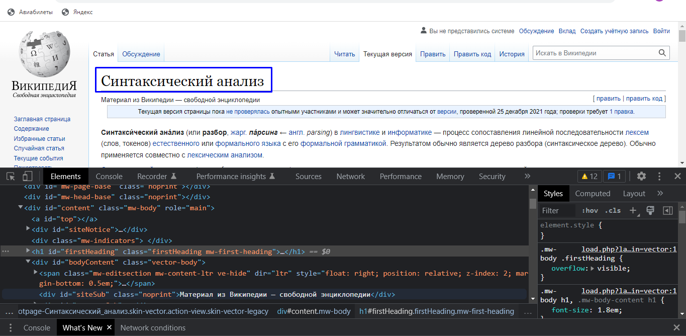

# Парсинг в Selenium

**Содержание**
- [Введение](#Введение-в-Selenium)
- [Типы сайтов и способы поиска элементов](#Типы-сайтов-и-способы-поиска-элементов-Парсим-карты-Minecraft)
- [Работа с cookies](#Работа-с-cookies)
- [Полезные настройки. Работа вебдрайвера](#Полезные-настройки-Работа-вебдрайвера)
- [Имитация пользователя](#Имитация-пользователя)
- [Приемы работы в Selenium](#Приемы-работы-в-Selenium)
- [Парсинг и настройки Chromedriver](#Парсинг-и-настройки-Chromedriver)
- [Правила безопасного парсинга](#Правила-безопасного-парсинга)

## Введение в Selenium
**Selenium** - один из лучших инструментов, который можно использовать при парсинге сайтов. Его главным преимуществом для нас будет  имитация реального пользователя. Таким образом можно автоматизировать сбор данных с сайтов, несмотря на их системы защиты против роботов.  

К сожалению не на всех сайтах удается беспрепятственно парсить данные даже с этим замечательным модулем, но в основном со своей задачей он справляется хорошо.  

### Приступаем к делу
Для работы с Selenium нужен вебдрайвер. Это специальная программа, которая имитирует работу браузера. Да мы, собсвенно и будем посещать сайты с браузера, но в автоматическом режиме.  

Но сначала нужно его скачать. Есть версия **Chromedriver** под [Chrome](https://chromedriver.chromium.org/downloads) и **Geckodriver** под [Firefox](https://github.com/mozilla/geckodriver/releases). Сразу скажу, что желательно использовать Geckodriver, потому что его можно очень гибко настроить под свои нужды, поэтому дальше будем разбирать примеры, используя Geckodriver. Скачивайте под свою версию браузера или близкое к ней.  

Теперь можем установить сам Selenium при помощи pip

```
pip install selenium
```
А теперь, когда все нужные файлы скачаны и Selenium установлен, мы можем приступать к написанию кода. Сначала рассмотрим базовые понятия и скелет программы, а потом спарсим данные с какого-нибудь сайта.  

**Файл с вебдрайвером должен быть в той же папке, что и программа.**

```python
#Скелет программы
from selenium import webdriver
import time #Для имитации задержки
options=webdriver.FirefoxOptions() #Создаем объект настроек
driver=webdriver.Firefox(options=options) #Создаем объект вебдрайвера и подключаем опции
try:
	driver.get('url') #Попадаем на нужный сайт
	tine.sleep(10) #Ждем 10 секунд
except:
	pass
finally:
	driver.close() #Закрывает окно
	driver.quit() #Полностью закрывает вебдрайвер
```
Крайне важно следовать именно такому скелету с попытками отлова ошибок. Сначала программа пытается попасть на нужный сайт. Если все хорошо, программа заходит на сайт и, через 10 секунд, переходит в блок finally, где идет закрытие вебдрайвера. Если же что-то пошло не так, программа входит в блок except и, учитывая, что там ничего нет, сразу же закрывает ведрайвер.  

А нужно это для того, чтобы незакрытые вебдрайвера не оставались в оперативной памяти. Это еще хорошо, если мы просто можем закрыть окно, но мы будем работать и в фоновом режиме вебдрайвера, где вход на сайт и все действия на нем будут производиться в фоновом режиме. Так-то можно конечно закрыть из Диспетчера задач, но зачем вам лишняя головная боль?

## Типы сайтов и способы поиска элементов. Парсим карты Minecraft
Перед началом сбора данных нужно провести разведку потенциального сайта. В этой статье речь пойдет о том, какие бывают сайты, а так же о том, как можно искать элементы.  

### Статические и динамические сайты
Здесь все очень просто. У статических сайтов все элементы загружаются сразу, а в динамических элементы грузятся не сразу, а подгружаются. Здесь вступает в силу чаще всего Javascript.  

Статические сайты проще парсить, а для динамических нужно ждать, пока все элементы подгрузятся и уже потом их получать. А если подгрузка элементов идет после полного скроллинга страницы вниз?  

Вот тут мы и подходим к преимуществам Selenium, так как на нем очень просто осуществить такие действия как скроллинг, клик по нужным элементам, заполнение различных форм, например для входа в аккаунт и так далее.  

### Поиск элементов в Selenium

```python
find_element_by_id #Поиск элемента по id
find_element_by_name #Поиск элемента по имени
find_element_by_xpath #Поиск элемента по xpath
find_element_by_link_text #Поиск элемента по тексту ссылки
find_element_by_tag_name #Поиск элемента по имени тега
find_element_by_class_name #Поиск элемента по имени класса
find_element_by_css_selector #Поиск элемента по css селектору
```

### Перейдем к практике

Зайдем на статью из Википедии по теме парсинга. [Переходим.](https://ru.wikipedia.org/wiki/Синтаксический_анализ) Теперь кликаем ПКМ по любой области экрана и выбираем **Просмотреть код**.



Далее жмем по кнопке (1). Теперь можно мышкой выбирать элементы. Выбираем нужный элемент (2) и кликаем по нему - будем парсить заголовок. Картинка ниже.

  


Как видим, наш элемент находится в теге **h1**, а это значит, что уместно искать по имени тега. Давайте вспомним наш код из предыдущего урока.

```python
from selenium import webdriver
import time
options=webdriver.FirefoxOptions()
driver=webdriver.Firefox(options=options)
try:
	driver.get("https://ru.wikipedia.org/wiki/Синтаксический_анализ") #Заходим на сайт
	time.sleep(2)
	head=driver.find_element_by_tag_name("h1") #Находим заголовок и помещаем его в переменную
	print(head.text) #Выводим текст
except:
	pass
finally:
	driver.close()
	driver.quit()
```

В код я добавил 2 строчки и немного изменил время задержки. Здесь мы сначала записываем наш результат в переменную, а потом выводим ее на экран. Обратите внимание на атрибут **text**. Без него мы получим весь элемент, а нам нужен только его текст. Можете попробовать убрать атрибут text и посмотреть, что получится.  

Но что, если нам нужно получить не один элемент, а сразу несколько?

```python
find_elements_by_id #Поиск элементов по id
find_elements_by_name #Поиск элементов по имени
find_elements_by_xpath #Поиск элементов по xpath
find_elements_by_link_text #Поиск элементов по тексту ссылки
find_elements_by_tag_name #Поиск элементов по имени тега
find_elements_by_class_name #Поиск элементов по имени класса
find_elements_by_css_selector #Поиск элементов по css селектору
```
Обратите внимание на то, что мы уже получаем не один элемент, а список элементов. Поэтому и обращаться с ним нужно соответственно.  

Давайте перейдем на сайт, где можно скачать карты для Minecraft и спарсим оттуда 1 страницу. Парсить будем заголовки, но вы можете спарсить и другие данные. [Переходим сюда](https://minecraft-inside.ru/maps/1.18.2/). Здесь тоже уместно искать по тегу, но сделаем еще кое что. В окне Инструментов разработчика зажимаем Ctrl+f - внизу открывается строка поиска. В нее вписываем наш тег.


```python
#Фрагмент кода
try:
	driver.get("https://minecraft-inside.ru/maps/1.18.2/")
	time.sleep(2)
	modName=driver.find_elements_by_tag_name("h2")
	for name in modName: #Проходимся в цикле по всем элементам
		print(name.text)
```
Теперь мы видим, что в консоли появился целый список карт.  

А сейчас давайте перейдем на вторую страницу нашего сайта и посмотрим как выглядит ссылка.

```
1 страница
https://minecraft-inside.ru/maps/1.18.2/
2 страница
https://minecraft-inside.ru/maps/1.18.2/page/2/
```
А теперь попробуйте изменить ссылку 2 страницы, поменяв **page/2/** на **page/1/**, и мы перейдем на 1 страницу. Это значит, что мы можем попробовать собрать все названия карт. Становится все интереснее!  

Ниже будет код полностью. Суть такова, мы будем проходить по ссылкам в цикле. Ну и еще добавим нумерацию перед каждой картой, чтобы узнать количество всех карт для версии 1.18.2.

```python
#Код полностью

from selenium import webdriver
import time
options=webdriver.FirefoxOptions()
driver=webdriver.Firefox(options=options)
mapNumber=1 #Нумерация карт
try:
	for _num in range(22): #Проходимся по страницам сайта
		num=_num+1 #Это, чтобы счет начинался не с 0, а с 1
		driver.get("https://minecraft-inside.ru/maps/1.18.2/page/{}/".format(num))
		time.sleep(2)
		mapName=driver.find_elements_by_tag_name("h2") #Ищем элемент с заголовками
		for name in mapName: #Проходимся по всем заголовкам в цикле
			print("{} - {}".format(mapNumber,name.text))
			mapNumber+=1 #Увеличиваем номер на 1
except:
	pass
finally:
	driver.close()
	driver.quit()
	print('Парсинг завершен!') #Выведется после окончания парсинга
```

Если в коде нет ошибок, программа спарсит все названия карт для версии Minecraft 1.18.2. Все будет выглядеть примерно в таком формате...


## Работа с cookies

Часто нам нужно получить какие-либо данные находясь под своим аккаунтом. Например, для парсинга закрытых веток форумов или социальных сетей (с ними будьте осторожны, так как там может быть защита от роботов, то есть от нас).

В таком случае нам нужно получить cookies - данные авторизации. Алгоритм тут весьма простой - сначала заходим на сайт и авторизуемся, далее получаем cookies. Затем заходим на сайт и загружаем cookies. Для записи в файл нам пригодится модуль pickle.

```python
import pickle
```

```python
# Фрагмент кода

driver.get("url")
time.sleep(100)
# Авторизуемся на сайте. Следующая строка запишет куки в файл
pickle.dump(driver.get_cookies(),open('название файла куков без расширения','wb'))
```

Все. Cookies сохранены в файл.  
Теперь можем загрузить их. Предыдущий код можно закомментировать или удалить. Он нам больше не понадобится.

```python
driver.get("url")
time.sleep(1)
for cookie in pickle.load(open('название файла куки без расширения','rb')): #Загружаем cookies
    driver.add_cookie(cookie)
driver.refresh() #Обновляем страницу
```

## Полезные настройки. Работа вебдрайвера

Разберем некоторые настройки для работы нашего парсера.

Внимание! Статья будет со временем пополняться.

```python
from selenium import webdriver
import time
options=webdriver.FirefoxOptions()
#...опции...
driver=webdriver.Firefox(options=options)
try:
	driver.get("https://www.amazon.com/")
	time.sleep(10)
except:
	pass
finally:
	driver.close()
	driver.quit()
```

Опции...

```python
options.set_preference("dom.webdriver.enabled",False) #отключает режим вебдрайвера
options.set_preference("dom.webnotifications.enabled",False) #отключает уведомления
options.set_preference("media.vilume_scale","0.0") #выключает звук
options.set_preference("general.useragent.override","юзер агент") #подмена юзер агента
options.headless=True #фоновый режим
permissions.default.image 1 #отключить изображения
javascript.enabled=False #отключает js
```

## Имитация пользователя
Большинство сайтов собирают различную информацию о пользователе. Это может быть IP фдрес, геолокация, user-agent, язык системы, разрешение экрана и так далее. Некоторым сайтам необходима эта информация для гибкой подстройки под пользователя и рекламы, но есть у этого и обратная сторона.

Многие сайты любят пользователей и недолюбливают всяких роботов и всячески мешают им нормально работать. Могут и блокнуть. Абсолютной защиты от такого нет, но в этой статье разберем несколько настроек, чтобы походить на реального пользователя и обмануть браузер.

### user-agent

Для наглядности зайдем на сайт [Headless Detector](https://infosimples.github.io/detect-headless/). Он больше подходит для Chrome, но нам нужен параметр **User Agent**.

Напомню код

```python
from selenium import webdriver
import time
options=webdriver.FirefoxOptions()
#...опции...
driver=webdriver.Firefox(options=options)
try:
	driver.get("https://infosimples.github.io/detect-headless/")
	time.sleep(30)
except:
	pass
finally:
	driver.close()
	driver.quit()
```

Там, где оставлен комментарий *опции*, впишем опцию

```python
options.set_preference("general.useragent.override","юзер агент")
```

Запустим программу и увидим, что напротив User-Agent будет надпись **юзер агент**.

Но с таким юзер-агентом браузеры легко спалят то, что это не от браузера, поэтому рассмотрим библиотеку **fake-useragent**, при помощи которой будем генерировать фейковые юзер-агенты. Для начала ее установим.

```
pip install fake-useragent
```

```python
from fake_useragent import UserAgent
ua = UserAgent()
# Имеются варианты
ua.ie
ua.msie
ua.opera
ua.chrome
ua.google
ua.firefox
ua.ff
ua.random
```

А теперь просто подставляем нужный юзер-агент

```python
options.set_preference("general.useragent.override",ua.opera)
```

### Отключение режима Вебдрайвера

На данный момент для Firefox опция не работает, поэтому дополню статью, когда найду решение.

## Приемы работы в Selenium

Здесь будем рассматривать различные приемы работы при парсинге сайтов. Статья будет постоянно пополняться.

### Скроллинг

```python
from selenium.webdriver.common.keys import Keys
# Фрагмент кода
scroll=driver.find_element_by_xpath("//*")
for i in range(100):
		scroll.send_keys(Keys.DOWN)
		time.sleep(1/60)
```

### Выводим отловленную ошибку в консоль

```python
import traceback
try:
	print(qwerty)
except:
	print(traceback.format_exc())
```

## Парсинг и настройки Chromedriver

На начальном этапе отличий немного, но есть на что обратить внимание.

```python
# Вместо
options=webdriver.FirefoxOptions()
# Будет так
options=webdriver.ChromeOptions()
```
И
```python
# Вместо
options.set_preference("option")
# Будет так
options.add_argument("option")
```

Далее перечислим настройки для Chromedriver. Список всех настроек можно найти [здесь](https://peter.sh/experiments/chromium-command-line-switches/).

```python
options.add_argument("headless") # запускает в фоновом режиме
options.add_argument('log-level=3') # меньше мусора в консоли
options.add_argument("user-agent = юзерагент") # меняет юзерагент
```

## Правила безопасного парсинга

Теперь кратко разберем тему безопасного парсинга. Ниже будут перечислены базовые правила для того, чтобы сайты не забанили вас уже через минуту вашей работы.

1. **Используйте задержки.** Согласитесь, странно, когда пользователь переходит на сайт и СРАЗУ ЖЕ кликает по какой-нибудь кнопке, например. **Напоминаю, что нам нужно быть таким же как рядовой пользователь.**

2. **Используйте fake-useragent**. Пусть лучше палится фейковый юзер-агент, чем реальный.

3. **Не рекомендую использовать ваши реальные учетные данные социальных сетей.** Аккаунт может быть заморожен или заблокирован. Вообще, крупные сайты, в том числе и социальные сети, могут позволить себе передовые технологии защиты от роботов. Если нужно парсить с cookies, то используйте левые аккаунты, которые не страшно потерять.

[:rewind:**Вернуться назад**](../../../README.md)