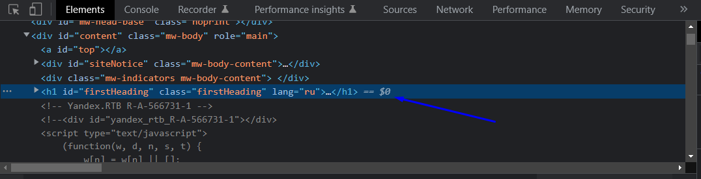

# Типы сайтов и способы поиска элементов + парсим карты Minecraft
Перед началом сбора данных нужно провести разведку потенциального сайта. В этой статье речь пойдет о том, какие бывают сайты, а так же о том, как можно искать элементы.  

## Статические и динамические сайты
Здесь все очень просто. У статических сайтов все элементы загружаются сразу, а в динамических элементы грузятся не сразу, а подгружаются. Здесь вступает в силу чаще всего Javascript.  

Статические сайты проще парсить, а для динамических нужно ждать, пока все элементы подгоузятся и уже потом их получать. А если подгоузка элементов идет после полного скроллинга страницы вниз?  

Вот тут мы и подходим к преимуществам Selenium, так как на нем очень просто осуществить такие действия как скроллинг, клик по нужным элементам, заполнение различных форм, например для входа в аккаунт и так далее.  

## Поиск элементов в Selenium

```python
find_element_by_id #Поиск элемента по id
find_element_by_name #Поиск элемента по имени
find_element_by_xpath #Поиск элемента по xpath
find_element_by_link_text #Поиск элемента по тексту ссылки
find_element_by_tag_name #Поиск элемента по имени тега
find_element_by_class_name #Поиск элемента по имени класса
find_element_by_css_selector #Поиск элемента по css селектору
```

## Перейдем к практике

Зайдем на статью из Википедии по теме парсинга. [Переходим.](https://ru.wikipedia.org/wiki/Синтаксический_анализ) Теперь кликаем ПКМ по любой области экрана и выбираем **Просмотреть код**.


Далее жмем по кнопке (1). Теперь можно мышкой выбирать элементы. Выбираем нужный элемент (2) и кликаем по нему - будем парсить заголовок. Картинка ниже.

  


Как видим, наш элемент находится в теге **h1**, а это значит, что уместно искать по имени тега. Давайте вспомним наш код из предыдущего урока.

```python
from selenium import webdriver
import time
options=webdriver.FirefoxOptions()
driver=webdriver.Firefox(options=options)
try:
	driver.get("https://ru.wikipedia.org/wiki/Синтаксический_анализ") #Заходим на сайт
	time.sleep(2)
	head=driver.find_element_by_tag_name("h1") #Находим заголовок и помещаем его в переменную
	print(head.text) #Выводим текст
except:
	pass
finally:
	driver.close()
	driver.quit()
```

В код я добавил 2 строчки и немного изменил время задержки. Здесь мы сначала записываем наш результат в переменную, а потом выводим ее на экран. Обратите внимание на атрибут **text**. Без него мы получим весь элемент, а нам нужен только его текст. Можете попробовать убрать атрибут text и посмотреть, что получится.  

Но что, если нам нужно получить не один элемент, а сразу несколько?

```python
find_elements_by_id #Поиск элементов по id
find_elements_by_name #Поиск элементов по имени
find_elements_by_xpath #Поиск элементов по xpath
find_elements_by_link_text #Поиск элементов по тексту ссылки
find_elements_by_tag_name #Поиск элементов по имени тега
find_elements_by_class_name #Поиск элементов по имени класса
find_elements_by_css_selector #Поиск элементов по css селектору
```
Обратите внимание на то, что мы уже получаем не один элемент, а список элементов. Поэтому и обращаться с ним нужно соответственно.  

Давайте перейдем на сайт, где можно скачать карты для Minecraft и спарсим оттуда 1 страницу. Парсить будем заголовки, но вы можете спарсить и другие данные. [Переходим сюда](https://minecraft-inside.ru/maps/1.18.2/). Здесь тоже уместно искать по тегу, но сделаем еще кое что. В окне Инструментов разработчика зажимаем Ctrl+f - внизу открывается строка поиска. В нее вписываем наш тег.


```python
#Фрагмент кода
try:
	driver.get("https://minecraft-inside.ru/maps/1.18.2/")
	time.sleep(2)
	modName=driver.find_elements_by_tag_name("h2")
	for name in modName: #Проходимся в цикле по всем элементам
		print(name.text)
```
Теперь мы видим, что в консоли появился целый список карт.  

А сейчас давайте перейдем на вторую страницу нашего сайта и посмотрим как выглядит ссылка.

```
1 страница
https://minecraft-inside.ru/maps/1.18.2/
2 страница
https://minecraft-inside.ru/maps/1.18.2/page/2/
```
А теперь попробуйте изменить ссылку 2 страницы, поменяв **page/2/** на **page/1/**, и мы перейдем на 1 страницу. Это значит, что мы можем попробовать собрать все названия карт. Становится все интереснее!  

Ниже будет код полностью. Суть такова, мы будем проходить по ссылкам в цикле. Ну и еще добавим нумерацию перед каждой картой, чтобы узнать количество всех карт для версии 1.18.2.

```python
#Код полностью

from selenium import webdriver
import time
options=webdriver.FirefoxOptions()
driver=webdriver.Firefox(options=options)
mapNumber=1 #Нумерация карт
try:
	for _num in range(22): #Проходимся по страницам сайта
		num=_num+1 #Это, чтобы счет начинался не с 0, а с 1
		driver.get("https://minecraft-inside.ru/maps/1.18.2/page/{}/".format(num))
		time.sleep(2)
		mapName=driver.find_elements_by_tag_name("h2") #Ищем элемент с заголовками
		for name in mapName: #Проходимся по всем заголовкам в цикле
			print("{} - {}".format(mapNumber,name.text))
			mapNumber+=1 #Увеличиваем номер на 1
except:
	pass
finally:
	driver.close()
	driver.quit()
	print('Парсинг завершен!') #Выведется после окончания парсинга
```

Если в коде нет ошибок, программа спарсит все названия карт для версии Minecraft 1.18.2. Все будет выглядеть примерно в таком формате...


[:rewind:**Вернуться назад**](../../../../../README.md)