# Режим редактирования

Здесь будут собраны различные техники редактирования объектов. Статья будет пополняться.

**Tab** - перейти в **Edit mode**.

### Трансформация

Клавиша|Значение|По X|По Y|По Z
---|---|---|---|---
S|Изменение размера|SX|SY|SZ
G|Перемещение|GX|GY|GZ
R|Вращение|RX|RY|RZ

Трансформировать можно грани и ребра. Вершины можно только перемещать.

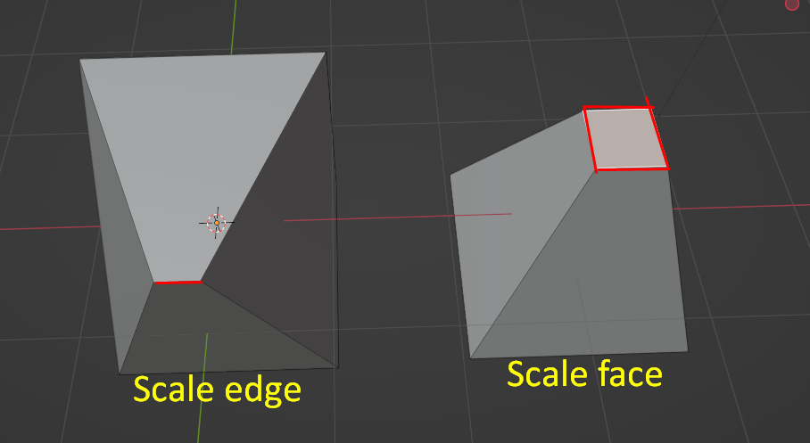

### Subdivide

Я создам плоскость для наглядности. Щелкнем в режиме выделения граней по нашей плоскости, далее **ПКМ - Subdivide**. Плоскость подразделится, мы видим уже 4 грани.

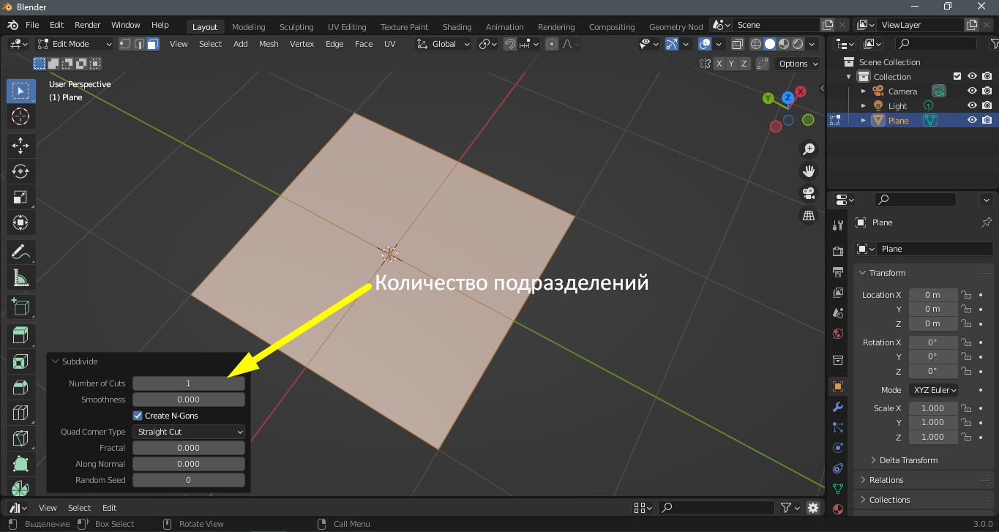

Давайте увеличим количество подразделений до 10. Если нужно больше 10, то вводим вручную.

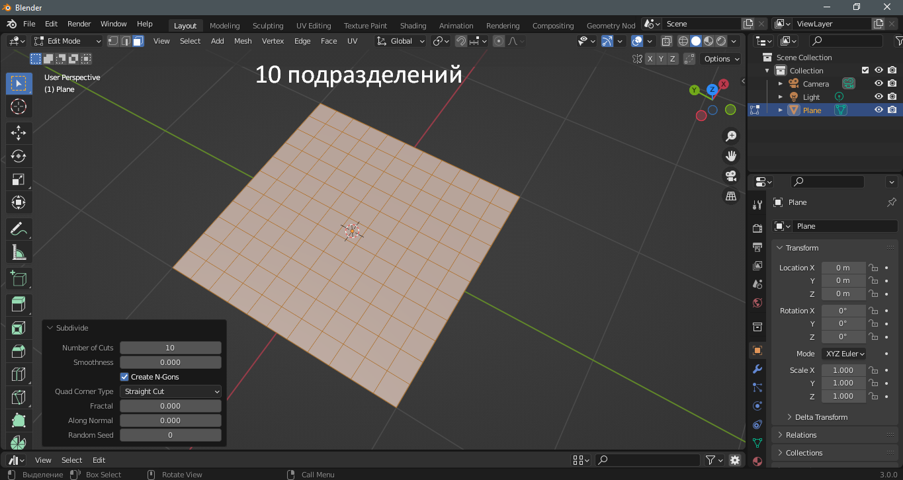
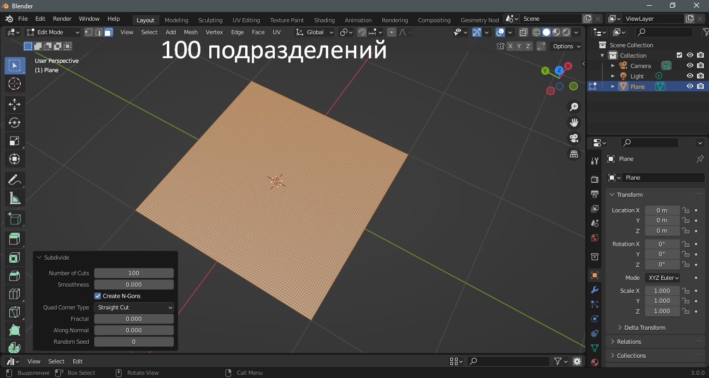

### Экструдирование

Создадим куб. Экструдировать можно вершины, ребра и грани. Экструд граней идет вдоль их нормалей, как показано ниже, а для ребер и вершин нужно задавать направление.

Клавиша **E** - экструдирование. Сделаем это.

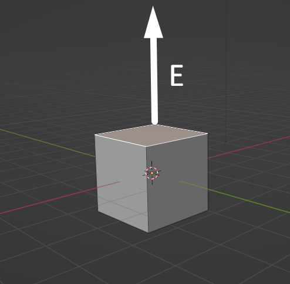
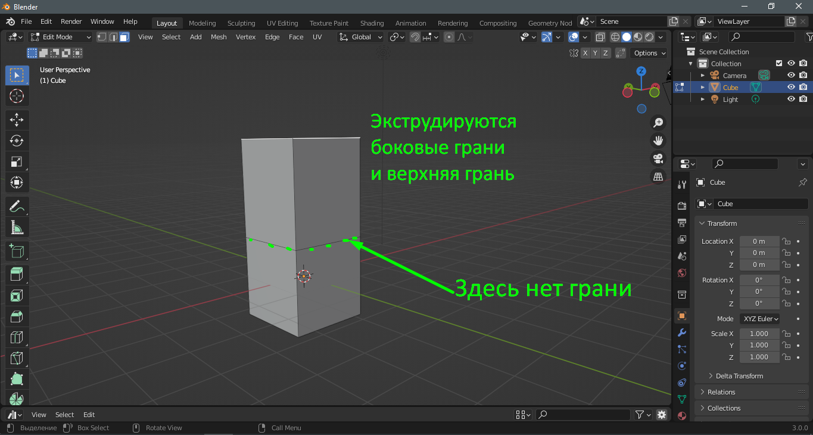

### Экструдирование по нормалям

Выделим боковые грани куба, нажмем **Alt E** и выберем **Extrude faces along normals**. Должно получиться как на 2 картинке ниже.

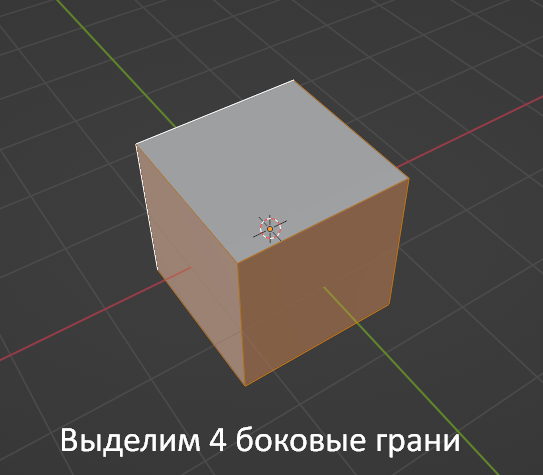
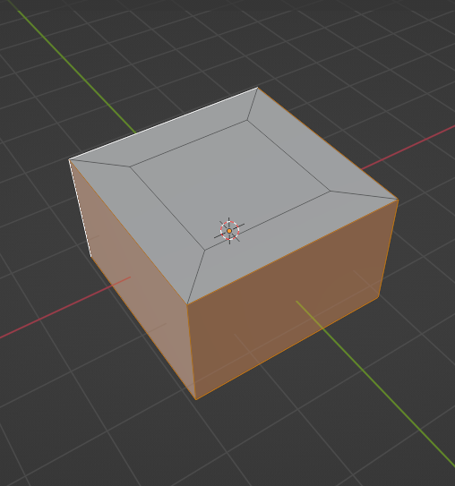

А так будет выглядеть цилиндр, если применить это к нему.

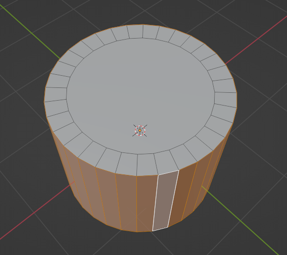

Можно заменить эти действия так - выделить боковые грани и нажать **E**, затем нажать **Esc**, потом **S Shift Z**. Таким образом исключается координата Z  из трансформации.

### Insert

Это еще одна форма экструда, но работает она иначе. Создадим плоскость, перейдем в режим выделения граней и нажмем на **I**. На картинке ниже показано, что должно получиться. Обратите внимание на то, что Insert можно применить только вовнутрь.

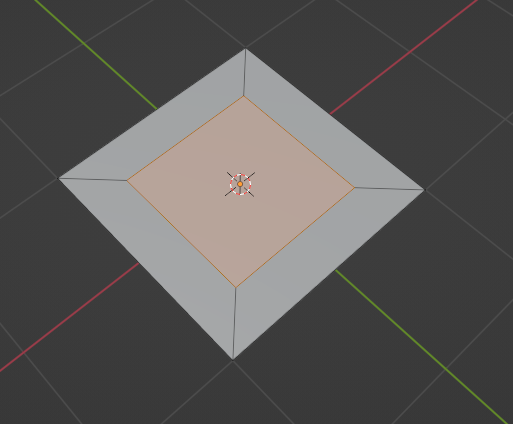

Создадим плоскость и подразделим ее, затем выделим грани и **нажмем 2 раза I**.

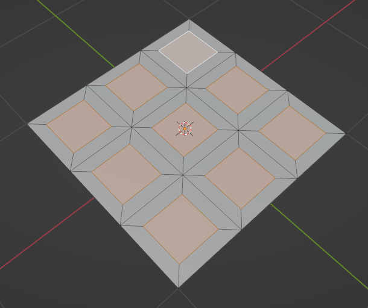

### Flip normals

Каждый полигон имеет 2 поверхности. Одна из них является изнанкой и, при экспорте модели в игровой движок, вывернутый наизнанку полигон не будет отображаться.

Допустим, у нас есть вот такая модель собачьей будки))). Кликаем последовательно и видим вывернутые нормали - они красные.

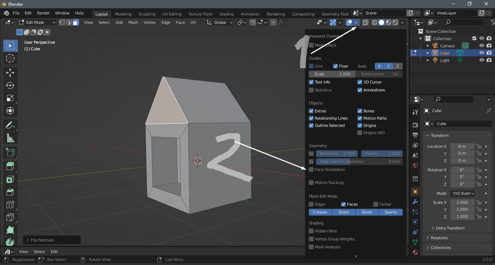
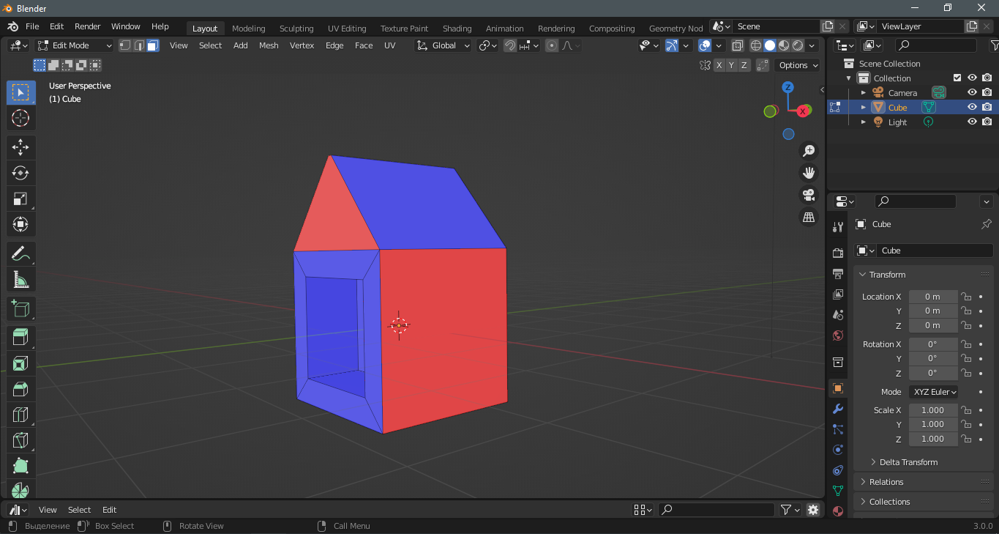

Чтобы вывернуть красные полигоны, нужно их выделить, нажать **Alt N** и выбрать **Flip**.

### Отделить в отдельный объект

Добавим шар и выделим нижнюю часть. Чтобы выделение было насквозь, жмем **Z** и выбираем **Wireframe**.

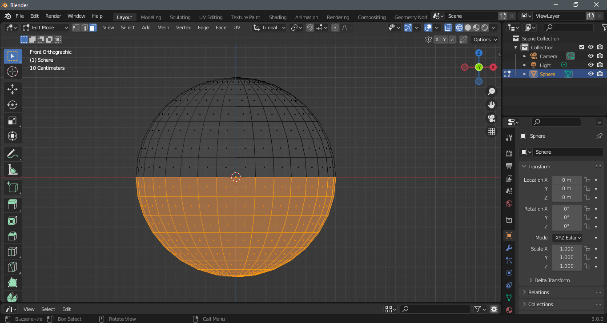

Для удобства снова жмем **Z - Solid**. Теперь жмем **P - Selection**. Я немного подвинул по Z верхний объект. Кстати да, **выделенная область стала другим независимым объектом.**

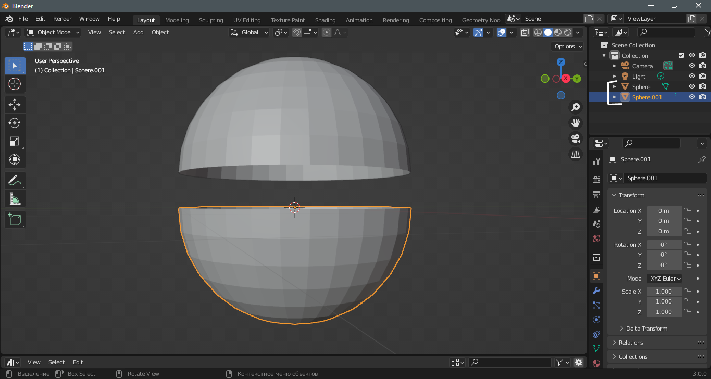

### Отделение полигонов от сетки.

Когда мы пробуем переместить какой-либо полигон, все соседние так же деформируются, но нам нужно переместить конкретный полигон...

Для этого выделяем нужный участок и кликаем **Mesh - Split - Selection**. Теперь выделенную область можно переместить.

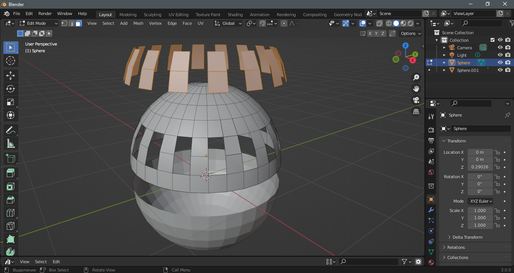

### Пропорциональное редактирование

Создадим плоскость и подразделим ее на 100. После этого нажмем клавишу **O** - включится пропорциональное редактирование. Выделим любую вершину, ребро или полигон, можно несколько и нажмем G Z.

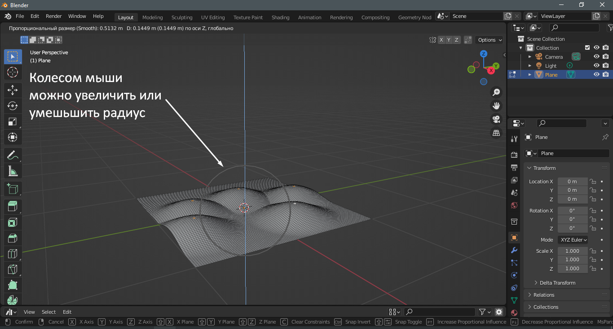

Здесь можно вручную включить и выключить пропорциональное редактирование, а так же изменить форму деформации и другие настройки.

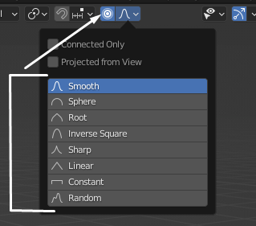

### Привязка

Позволяет прилепить объект или часть его к определенным вершинам, ребрам или полигонам.

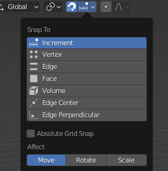

Здесь, как и в прошлом случае, отображаются настройки и способы привязки. Есть и другие привязки, например, к сетке. Можно с шифтом выбирать несколько привязок, например и к вершинам, и к полигонам.

[:rewind:**Вернуться назад**](../../../../README.md)