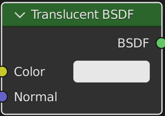

# Материалы

Здесь рассмотрим особенности материалов и работы с нодами.

### Система нодов

Разделим окно и откроем Shader Editor.

#### Горячие клавиши

|Сочетание клавиш|Описание
|----|----
|**Shift A**|Меню выбора нодов
|**H**|Сделать ноду компактной
|**Del, X**|Удалить ноду
|**Ctrl J**|Поместить несколько нодов в фрейм
|**Ctrl G**|Поместить выбранные

#### Введение в основы

Все ноды разделены по группам. Есть шейдеры, есть текстуры, ноды обработки цвета и так далее. Дальше разберем некоторые группы подробнее.

**Shader** - здесь собраны все шейдеры. По сути это способ отрисовки всего остального и основа для любого материала.  
**Texture** - группа, где можно выбрать процедурные текстуры или загрузить конкретную картинку, или создать свою.  
**Color** - здесь все, что связано с обработкой и смешиванием цветов.  
**Vector** - различные ноды, которые определяют положение текстур, их отрисовку и так далее.  
**Converter** - ноды преобразования. Преобразуют одни данные в другие.  
**Search** - здесь можно искать ноды.

#### Управление в Shader Editor

Нажав CtrlSpace можно развернуть окно на весь экран, так же и для того, чтобы перейти обратно. На картинке выше мы видим ноду Output и Principled BSDF. Output - это нода выхода. По сути то, что мы будем видеть в итоге, а нода Principled BSDF - это шейдер, который является основой для любого материала.

Разберем подробнее Output.

Surface - то, что будет отрисовываться на поверхности меша.  
Volume - то, что будет отрисовываться внутри. Обязателен рендер Cycles.  
Displacement - задает дополнительные изменения геометрии. Обязателен рендер Cycles.

В нашем примере выход шейдера подключен к Output в гнездо Surface. Так мы будем отрисовывать шейдер на поверхности.

Нажав Ctrl и проведя ПКМ по проводу, его можно перерезать. Если зажать Ctrl и зажать ЛКМ по гнезду входа, где есть соединение, можно отключить его от гнезда и переключить в другое. Щелкая по ноде и нажимая M, мы замораживаем ноду, фактически отключая ее. Колесо мыши масштабирует ноды. Ноду можно двигать мышкой или клавишей G и можно задать координату X или Y.

### Шейдеры

Разберем некоторые шейдеры

|Название|Вид|Описание
|---|---|---
|**Principled BSDF**||Стандартный шейдер, в котором уже есть по сути все необходимое
|**Emission**||Шейдер свечения
|**Glass BSDF**||Шейдер стекла
|**Glossy**||Шейдер глянца
|**Mix Shader**||Смешивает 2 шейдера
|**Principled Volume**||Универсальный шейдер для Volume. Использовать рендер Cycles.
|**Translucent BSDF**||Позволяет сделать просвечиваемые материалы, как у листвы.
