# Скульптинг

### Содержание

[Базовое управление](#Интерфейс)  
[Remesh](#Remesh)  
[Dyntopo](#Dyntopo)  

### Интерфейс

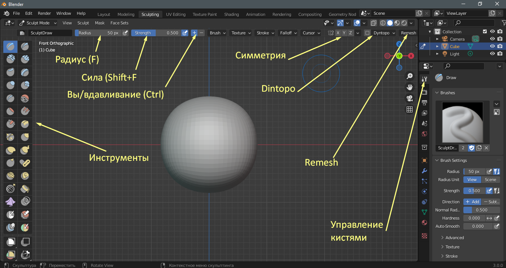

### Базовое управление

При помощи клавиши **F** можно увеличить или уменьшить радиус кисти. Если нажать **Shift F**, то будет изменяться сила нажатия кисти. Можно менять вручную в соответствующих полях.

При нажатии **Ctrl** и **ЛКМ**, мы увидим, что кисть вдавливает геометрию. Можно изменить, поменяв местами + и -, на рисунке выше показано. В таком случае все будет наоборот - при зажимании **Ctrl** геометрия будет выталкиваться.

В панели с инструментами можно выбрать нужный инструмент, а в разделе Управления кистями, в нашем случае, можно настроить различные параметры кистей, о чем поговорим чуть позже.

В вкладке **Symmetry** можно выбрать ось симметрии, в результате чего можно лепить симметричные меши, например лица, руки, ноги, уши и так далее.

В вкладке **Remesh** можно активировать ремеш - перестройку сетки, используя полигоны одинаковых размеров по всей площади.

Во вкладке **Dyntopo** можно включить динамическую топологию, в результате чего новые полигоны будут создаваться по мере лепки.

### Remesh

Ремеш - перестраивание всей сетки, которая после обработки будет состоять из полигонов одного размера. Нужен чаще всего для увеличения количества полигонов для большей детализации.

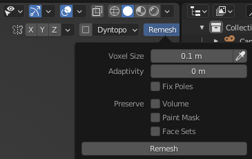

**Voxel Size** - размер полигонов. Чем меньше значение, тем больше детализация и тем больше нагрузка системы.
После выбора значения жмем кнопку **Remesh** и ждем, пока построится новая сетка геометрии. Это может занять время.

Есть и другой способ сделать Remesh. Зажимая **Shift R** и перемещая мышь, можно регулировать размер вокселей (полигонов). Жмем потом **ЛКМ**. **Ctrl R** - применить наш Remesh.

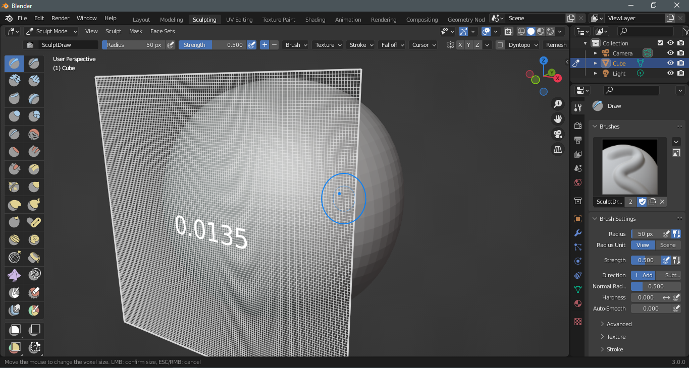

### Dyntopo

Динамическая топология позволяет строить сетку по мере лепки, что бывает очень удобно, но неправильное использование может нагружать систему.

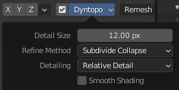

Для удобства лучше зайти в **Detalling** и поменять на **Constant Detail**. Некоторые кисти не поддерживают динамическую топологию.

### Инструменты

Далее будет представлено описание некоторых инструментов, которыми я часто пользуюсь.

#### Draw

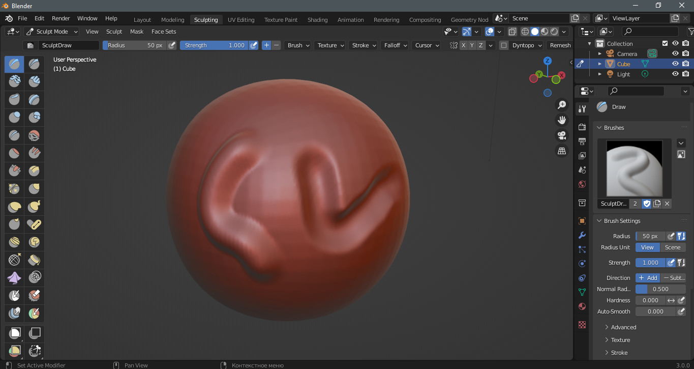

Простой инструмент для рисования.

#### Draw Sharp

Как и предыдущий, но рисует более остро.

#### Clay

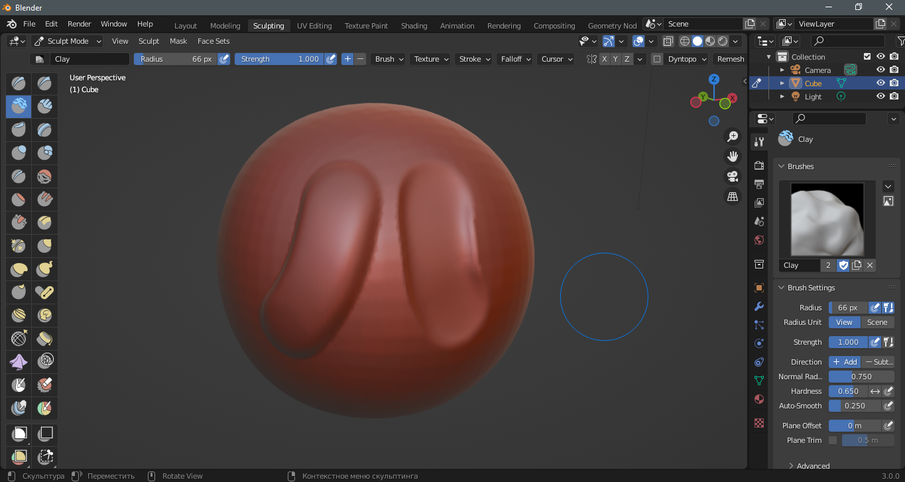

Рисует с крутыми боковыми гранями, как на картинке ниже.

#### Clay Strips

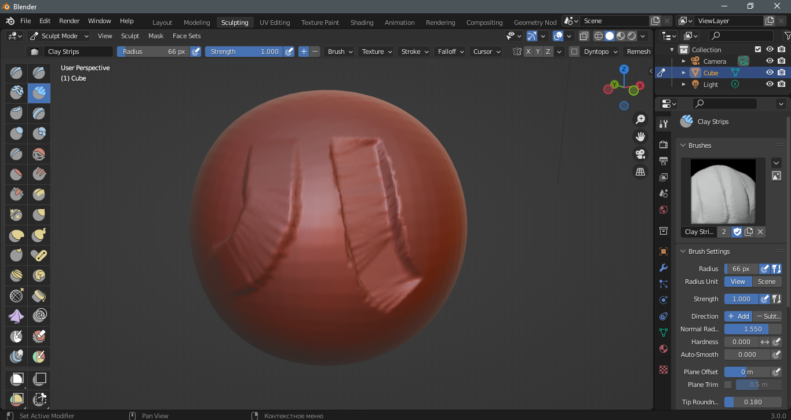

Как и предыдущий, но есть неравномерность.

#### Layer

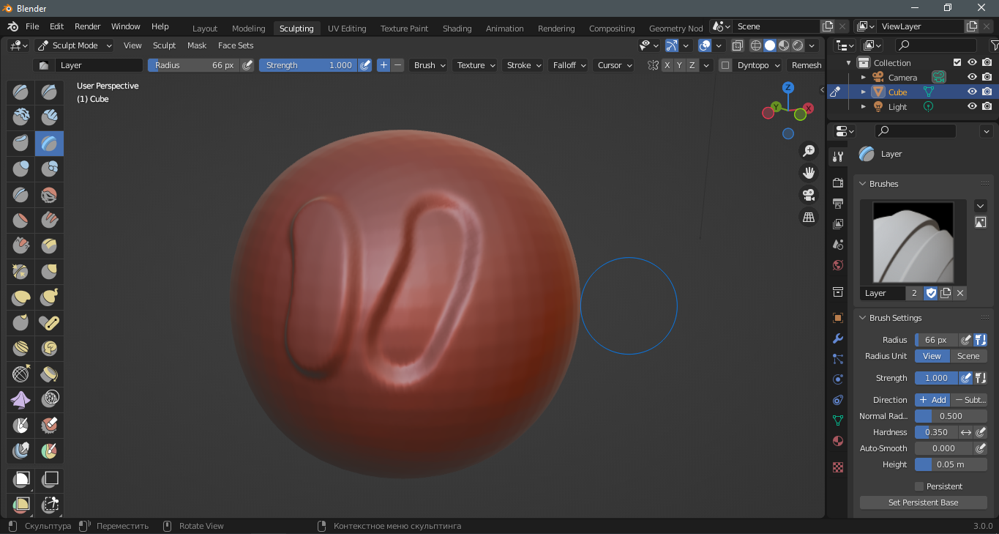

Очень похож на Clay.

#### Crease

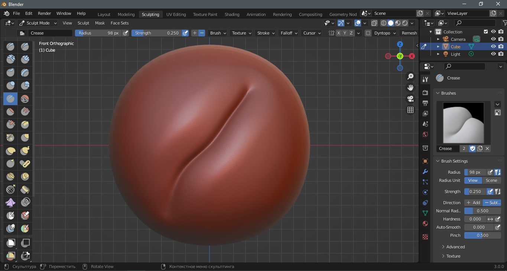

Создает складки.

#### Smooth

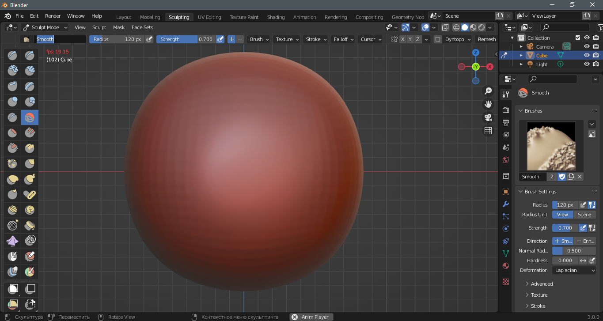

Разглаживает геометрию

#### Grab

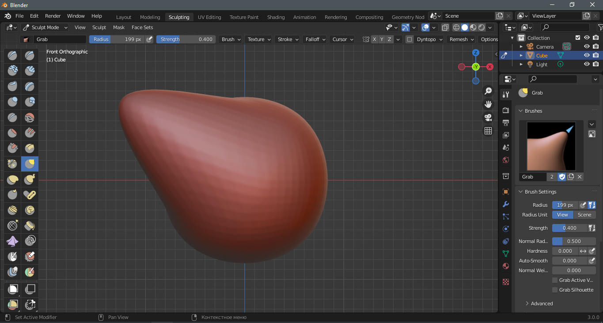

Инструмент вытягивания. Не поддерживает динамическую топологию.

#### Snake Hock

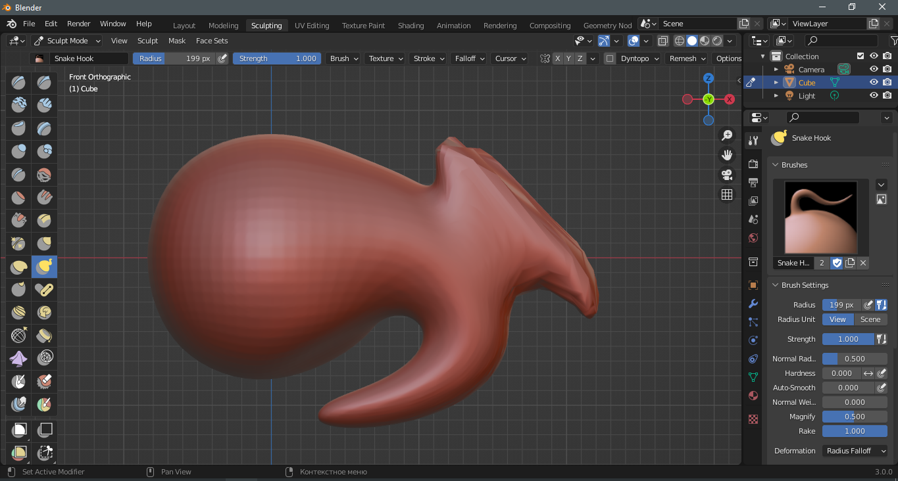

Инструмент вытягивания. Поддерживает динамическую топологию.

#### Mask

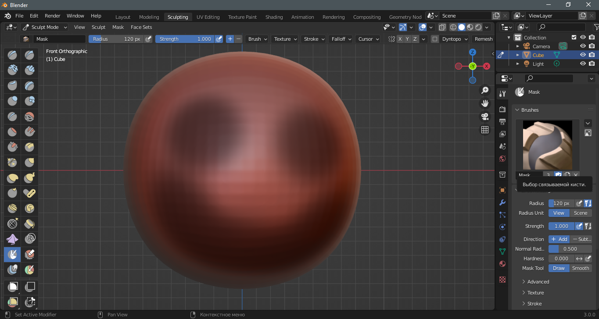

Маска. Все, что под ней, не будет подвергаться изменению. **Ctrl I** - инвертировать маску. **Alt M** - снять маску. **M** - маска.

#### Box Trim

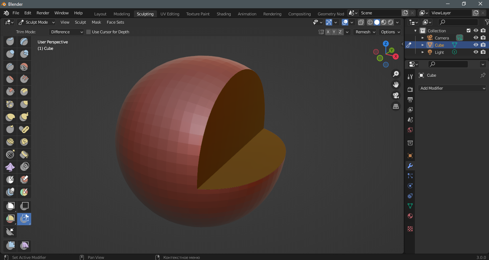

Позволяет вырезать куски геометрии. Имеет несколько режимов, в том числе для создания примитивов.

### Симметрия

Позволяет лепить симметрично.

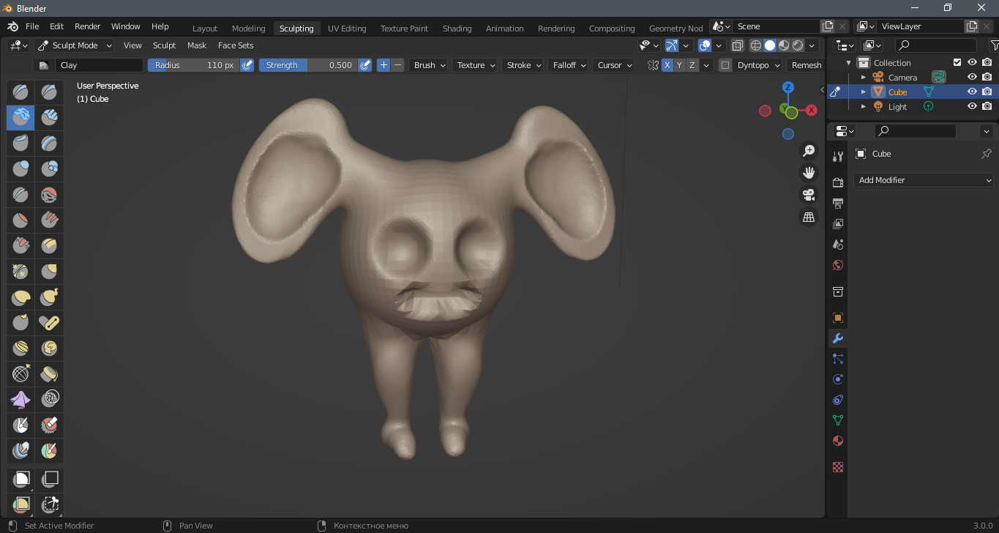

Используя вышеописанные инструменты, я создал за пару минут вот такого няшного сука монстра из ночных кошмаров. Попробуйте потренироваться и слепить что-нибудь.

#### Симметрия объектов

Иногда при скульптинге нам нужно создать какие-то объекты отдельно, например руки или ноги. Возникает вопрос, как сделать их так, чтобы они были симметричны туловищу? Можно использовать модификатор Mirror, но в окне скульптинга уже есть готовое решение - в той же вкладке с симметрией. Разберемся подробнее, как это реализовать.

Представим, что мы делаем ноги. Не буду вдаваться в детализацию, просто слеплю нечто отдаленно похожее и мультяшное.
После создания я перемещаю наш объект по X.

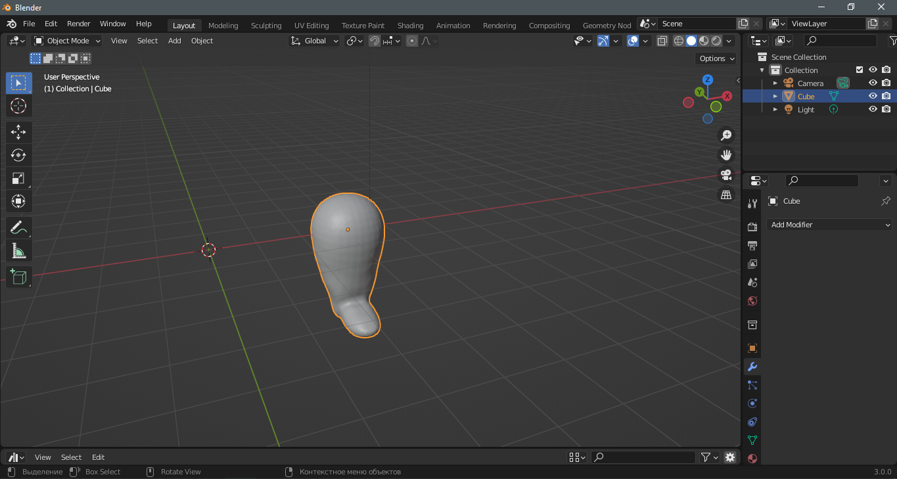

Теперь жмем ПКМ по объекту и выбираем **Set origin - Origin to 3d cursor**. Таким образом мы переместили центр объекта в нулевую позицию, которая и является центром симметрии. Теперь переходим в режим скульптинга и жмем на стрелочку рядом с симметрией.

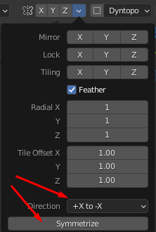

Выбираем параметр симметрии и жмем Symmetrize. И мы получили 2 симметричные ноги.

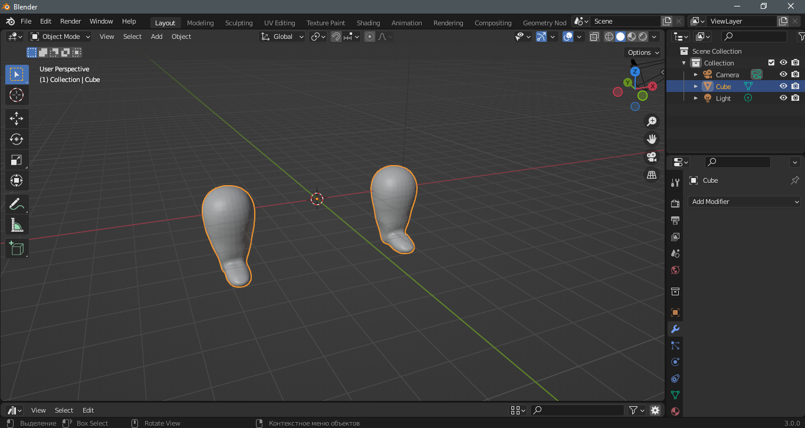

[:rewind:**Вернуться назад**](../../../../README.md)