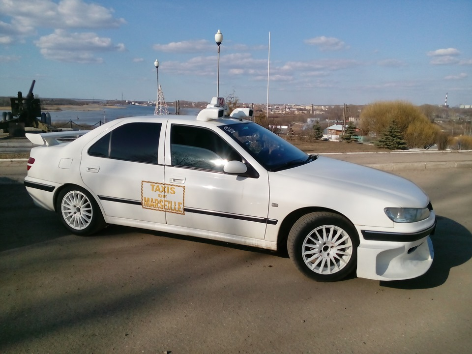

## Автомобиль из фильма Такси - Peugeot 406
11-05-2022 08:10

Wikipedia https://ru.wikipedia.org/wiki/Peugeot_406

Peugeot 406 — автомобиль D-сегмента, выпускавшийся под маркой Peugeot в кузовах седан, универсал и купе.

Оснащался как бензиновыми (объёмом от 1,6 до 3,0 л), так и дизельными двигателями. Дизайн кузова купе был разработан при участии итальянской студии Pininfarina. Модель 406 в исполнении седан был представлен в октябре 1995 года, как замена устаревшей модели 405, годом позже был представлен универсал, а ещё через год — 406 Coupe. В 1999 году был произведён рестайлинг модели, незначительно изменился внешний вид и существенно обновился ряд двигателей.

406 по желанию заказчика комплектовался широким спектром дополнительного оборудования: климат-контроль, круиз-контроль, бортовой компьютер, навигационная система, датчики света и дождя, электронная адаптивная подвеска, адаптивный ГУР, электронные системы ABS, Brake Assist, ESP, четыре SRS, зеркала с электроприводом и электроскладыванием, электрический люк, CD-магнитола с чейнджером, атермальное лобовое стекло, автоматически затемняющееся зеркало заднего вида, кожаный салон в трех цветовых вариантах, передние сиденья с электроприводом и памятью.
